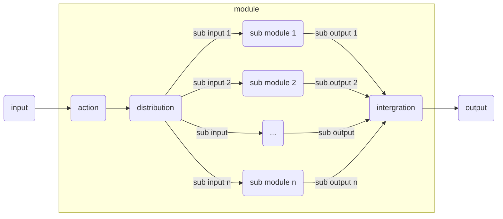
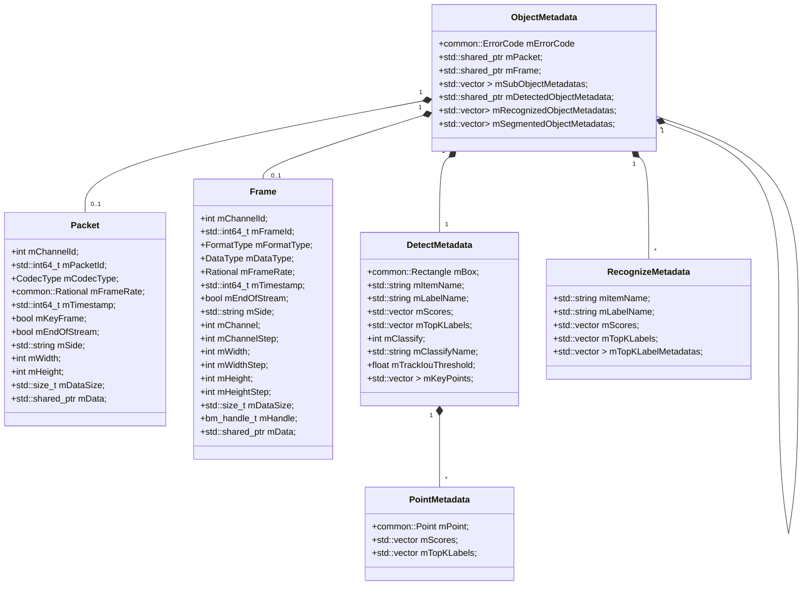

[TOC]

# Sophon Stream通用可配置的AI业务流设计方案


接下来以车辆二次识别这个业务为例，讲述这套通用可配置AI业务流的设计思想。


## 组合设计模式的通用配置



通用思想就是抽象模型所作的工作，action为两大类：detect和recognize。这两大类主要的区别在输出的格式不同。

+ detect：检测，用于确定物体在图中的位置。通常输出一个box，同时带有一个分类label和对应的score。有些检测模型还附带输出一系列特征点，特征点含义根据模型不同而不同。考虑到可能存在top k的需求，原始的每个label的score以score数组的形式输出。

+ recognize：识别，用于确定图中物体的属性。通常输出一个分类label和对应的score。考虑到可能存在top k的需求，原始的每个label的score以score数组的形式输出。如果输出是特征值，则特征值即score数组。


上图高度概括了检测和识别之间的关系。将一整个模型的业务流程抽象成一个模块；一个模块的工作包括对该模块对应的图片进行识别，以及检测子对象；每个检测处的子对象即对应一张子图，每个子图又对应一个子模块，以此类推。

上图模块中每个结点根据实际配置都是可选的。例如最外层的图片是原图，对于原图不存在识别，没有recognize结点，直接从input连到detect；最内层的图片是子图，没有更深层的子对象的属性，没有从到distribution到intergration的结点，直接从detect连到output；最内层也可能连检测也没有，只有一个recognize。


模型结点之间的关系通过组合设计模式进行嵌套，模型输出之间的关系也同样需要通过组合模式进行嵌套：

```

struct ObjectMetadata {
    common::ErrorCode mErrorCode;

    std::shared_ptr<common::Packet> mPacket;
    std::shared_ptr<common::Frame> mFrame;
    std::vector<std::shared_ptr<ObjectMetadata> > mSubObjectMetadatas;
    std::shared_ptr<common::DetectedObjectMetadata> mDetectedObjectMetadata;
    std::vector<std::shared_ptr<common::RecognizedObjectMetadata>> mRecognizedObjectMetadatas;
    std::vector<std::shared_ptr<common::SegmentedObjectMetadata>> mSegmentedObjectMetadatas;

};
```

Metadata的名字参考deepstream，但deepstream的Metadata并非嵌套定义的组合设计模式。

1. mErrorCode用于记录流处理过程中发生的错误，顶层Metadata的错误通常与解码相关，子Metadata的错误通常与图像处理相关。
2. mPacket和mFrame，分别存储解码前后的数据。
3. mDetectedObjectMetadata，检测结果，和Metadata同时初始化。
4. mRecognizedObjectMetadatas，识别结果列表，每当识别一个属性，就创建一个RecognizedObjectMetadata并将其加入mRecognizedObjectMetadatas。
5. mSubObjectMetadatas，子对象元数据列表，每当检测出一个子对象，就创建一个子Metadata并将其加入mSubObjectMetadatas。子Metadata从父Metadata拷贝mPacket，mFrame，并将检测结果填入mDetectedObjectMetadata。 


## 模型的通用配置，输入和输出


在algorithm模块中AlgorithmApi基类对外开放了init process和uninit接口。算法通过init接口的入参json字符串进行配置，例如yolov5的配置：
```
{
            "algorithm_name": "Yolov5",
            "input_node_name": [
              "input.1"
            ],
            "input_shape": [
              [
                1,
                3,
                640,
                640
              ]
            ],
            "label_names": [
              "person",
              "bicycle",
              "car",
              "motorbike",
              "aeroplane",
              "bus",
              "train",
              "truck",
              "boat",
              "traffic light",
              "fire hydrant",
              "stop sign",
              "parking meter",
              "bench",
              "bird",
              "cat",
              "dog",
              "horse",
              "sheep",
              "cow",
              "elephant",
              "bear",
              "zebra",
              "giraffe",
              "backpack",
              "umbrella",
              "handbag",
              "tie",
              "suitcase",
              "frisbee",
              "skis",
              "snowboard",
              "sports ball",
              "kite",
              "baseball bat",
              "baseball glove",
              "skateboard",
              "surfboard",
              "tennis racket",
              "bottle",
              "wine glass",
              "cup",
              "fork",
              "knife",
              "spoon",
              "bowl",
              "banana",
              "apple",
              "sandwich",
              "orange",
              "broccoli",
              "carrot",
              "hot dog",
              "pizza",
              "donut",
              "cake",
              "chair",
              "sofa",
              "pottedplant",
              "bed",
              "diningtable",
              "toilet",
              "tvmonitor",
              "laptop",
              "mouse",
              "remote",
              "keyboard",
              "cell phone",
              "microwave",
              "oven",
              "toaster",
              "sink",
              "refrigerator",
              "book",
              "clock",
              "vase",
              "scissors",
              "teddy bear",
              "hair drier",
              "toothbrus"
            ],
            "max_batchsize": 1,
            "model_path": [
              "../models/yolov5.bmodel"
            ],
            "name": "yolov5s_fp32_b1",
            "num_class": 80,
            "num_inputs": [
              1
            ],
            "num_outputs": [
              3
            ],
            "output_node_name": [
              "147",
              "148",
              "149"
            ],
            "output_shape": [
              [
                1,
                3,
                80,
                80,
                85
              ],
              [
                1,
                3,
                40,
                40,
                85
              ],
              [
                1,
                3,
                20,
                20,
                85
              ]
            ],
            "shared_object": "../lib/libalgorithmApi.so",
            "threthold": [
              0.50000001192092896,
              0.5000000059604645
            ]
          }
```


#### DetectMetadata

DetectMetadata具体定义如下：

```
struct PointMetadata {
    common::Point<int> mPoint;
    std::vector<float> mScores;
    std::vector<int> mTopKLabels;
};

struct DetectMetadata {
    common::Rectangle<int> mBox;
    std::string mLabelName;
    std::vector<float> mScores;
    std::vector<int> mTopKLabels;
    int mClassify;
    std::string mClassifyName;
    std::vector<std::shared_ptr<PointMetadata> > mKeyPoints;
};
```

+ mBox，检测框。
+ mLabelName，得分最高的标签。
+ mScores，得分数组。
+ mTopKLabels，label的topk
+ mClassify，分类，用于子对象流程，用过模型配置的标签分类映射表得到。
+ mClassifyName，分类名字，通过模型配置的分类名字映射表得到，方便阅读和输出。
+ mKeyPoints，关键点列表。如人脸五官位置，区域多边形顶点等。


#### RecognizeMetadata

RecognizeMetadata具体定义如下：

```
struct LabelMetadata {
    std::string mFeature;
};

struct RecognizeMetadata {
    std::string mLabelName;
    std::vector<float> mScores;
    std::vector<int> mTopKLabels;
    std::vector<std::shared_ptr<LabelMetadata> > mTopKLabelMetadatas;
};
```

+ mLabelName，得分最高的标签对应的名字，通过模型配置的标签名字映射表得到，方便阅读或输出。
+ mScores，所有标签得分表，下标即标签。由模型配置参数控制是否填写，有的模型标签个数高达上万。对于输出特征值的模型，mScores即为特征向量。
+ mTopKLabels，label的topk.
+ mTopKLabelMetadatas，lable feature的topk.


## 通用配置方式

以下为yolov5 usecase的json配置：
connections是一个数组，里面描述了每个element的连接关系，构成了一个有向无环图。
其中dst_id和src_id分别为源element和目标element的id。dst_port和src_port分别为element数据管道的id。
elements是一个数组，里面
### json配置
{
  "connections": [
    {
      "dst_id": 5001,
      "dst_port": 0,
      "src_id": 5000,
      "src_port": 0
    },
    {
      "dst_id": 5006,
      "dst_port": 0,
      "src_id": 5001,
      "src_port": 0
    },
    {
      "dst_id": 5555,
      "dst_port": 0,
      "src_id": 5006,
      "src_port": 0
    }
  ],
  "elements": [
    {
      "configure": {
        "shared_object": "../lib/libmultiMediaApi.so"
      },
      "device_id": 0,
      "id": 5000,
      "milliseconds_timeout": 0, // 队列为空时的等待超时时间
      "name": "decoder_element",
      "repeated_timeout": false,// true时继续wait，不执行任务，false时会执行任务。
      "side": "sophgo",
      "thread_number": 1
    },
    {
      "configure": {
        "batch": 1
      },
      "device_id": 0,
      "id": 5555,
      "milliseconds_timeout": 0,
      "name": "report_element",
      "repeated_timeout": false,
      "side": "host",
      "thread_number": 1
    },
    {
      "configure": {
        "batch": 1,
        "models": [
          {
            "algorithm_name": "Yolov5",
            "input_node_name": [
              "input.1"
            ],
            "input_shape": [
              [
                1,
                3,
                640,
                640
              ]
            ],
            "label_names": [
              "person",
              "bicycle",
              "car",
              "motorbike",
              "aeroplane",
              "bus",
              "train",
              "truck",
              "boat",
              "traffic light",
              "fire hydrant",
              "stop sign",
              "parking meter",
              "bench",
              "bird",
              "cat",
              "dog",
              "horse",
              "sheep",
              "cow",
              "elephant",
              "bear",
              "zebra",
              "giraffe",
              "backpack",
              "umbrella",
              "handbag",
              "tie",
              "suitcase",
              "frisbee",
              "skis",
              "snowboard",
              "sports ball",
              "kite",
              "baseball bat",
              "baseball glove",
              "skateboard",
              "surfboard",
              "tennis racket",
              "bottle",
              "wine glass",
              "cup",
              "fork",
              "knife",
              "spoon",
              "bowl",
              "banana",
              "apple",
              "sandwich",
              "orange",
              "broccoli",
              "carrot",
              "hot dog",
              "pizza",
              "donut",
              "cake",
              "chair",
              "sofa",
              "pottedplant",
              "bed",
              "diningtable",
              "toilet",
              "tvmonitor",
              "laptop",
              "mouse",
              "remote",
              "keyboard",
              "cell phone",
              "microwave",
              "oven",
              "toaster",
              "sink",
              "refrigerator",
              "book",
              "clock",
              "vase",
              "scissors",
              "teddy bear",
              "hair drier",
              "toothbrus"
            ],
            "max_batchsize": 1,
            "model_path": [
              "../models/yolov5.bmodel"
            ],
            "name": "cocoDetect",
            "num_class": 80,
            "num_inputs": [
              1
            ],
            "num_outputs": [
              3
            ],
            "output_node_name": [
              "147",
              "148",
              "149"
            ],
            "output_shape": [
              [
                1,
                3,
                80,
                80,
                85
              ],
              [
                1,
                3,
                40,
                40,
                85
              ],
              [
                1,
                3,
                20,
                20,
                85
              ]
            ],
            "shared_object": "../lib/libalgorithmApi.so",
            "threthold": [
              0.500000,
              0.500000
            ]
          }
        ]
      },
      "device_id": 0,
      "id": 5001,
      "milliseconds_timeout": 200,
      "name": "action_element",
      "repeated_timeout": false,
      "side": "sophgo",
      "thread_number": 1
    },
    {
      "configure": {
        "batch": 1,
        "models": [
          {
            "algorithm_name": "encode_picture",
            "max_batchsize": 1,
            "name": "",
            "shared_object": "../lib/libalgorithmApi.so"
          }
        ]
      },
      "device_id": 0,
      "id": 5006,
      "milliseconds_timeout": 200,
      "name": "action_element",
      "repeated_timeout": true,
      "side": "host",
      "thread_number": 1
    }
  ],
  "graph_id": 1
}


## 代码结构

### sophon_stream::ElementManager

```
class ElementManager {
public:
	using DataHandler = sophon_stream::Element::DataHandler;

    ElementManager();
    ~ElementManager();
    
    int Init(const std::string& json);
    void Uninit();
    
    void Start();
    void Stop();
    
    int SendData(int Element_id, 
                 int input_port, 
                 std::shared_ptr<void> data);
    void SetDataHandler(int Element_id,
                        int output_port,
                        DataHandler data_handler);

private:
    void Connect(int src_Element_id,
                 int src_Element_port,
                 int dst_Element_id,
                 int dst_Element_port);
                 
    std::map<int, std::shared_ptr<sophon_stream::Element> > m_Elements;
};
```

1. 通过Init和Uninit初始化和反初始化。减少Init的参数，全部由json提供。
   1. 设备由side和device_id字段提供。
   2. 根据返回值确定整个有向图的初始化是否成功以及因何失败。
   3. 允许一个sophon_stream::ElementManager中由多条流（pipeline），通过SendData指定流入口，通过SetDataHandler设置回调接收流出口数据。
2. 通过Start和Stop启停sophon_stream::Element中的线程。
3. sophon_stream::Element之间的连接是在sophon_stream::ElementManager中实现的。
4. sophon_stream::ElementManager需要明确将请求发给哪个sophon_stream::Element以及从哪个sophon_stream::Element接收数据。


### sophon_stream::Element

```
class Element {
public:
    using DataHandler = std::function<void(shared_ptr<void>)>;
    
    static void Connect(const Element& src_Element,
    					int src_Element_port, 
                        const Element& dst_Element, 
                        int dst_Element_port);
                          
    Element();
    virtual ~Element();

    int Init(const std::string& json);
    void Uninit();

    void Start();
    void Stop();

    int PushData(int input_port, 
                 std::shared_ptr<void> data,
                 int milliseconds_timeout = 0);
    void SetDataHandler(int output_port, 
                        DataHandler data_handler);
                        
    int GetId() const;
    int GetDeviceId() const;
    
    int GetThreadNum() const;
    bool GetTimeout() const;
    bool GetRepeatedTimeout() const;

protected:
    virtual int InitInternal(const std::string& json) = 0;
    virtual void UninitInternal() = 0;
    
    virtual void OnStart() = 0;
    virtual void OnStop() = 0;
    
    void run();
    virtual void DoWork() = 0;
    
    std::size_t GetDataCount(int input_port) const;
    std::shared_ptr<void> GetData(int input_port) const;
    void PopData(int input_port);

    int SendData(int output_port, 
                 std::shared_ptr<void> data,
                 int milliseconds_timeout = 0);
private:
    void OnInputNotify();
    
    int m_id;
    int m_device_id;
    
    int m_thread_num;
    std::vector<std::shared_ptr<std::thread> > m_threads;

    int m_timeout;
    bool m_repeated_timeout;
    std::mutex m_mutex;
    std::condition_variable m_cond;

    std::vector<std::shared_ptr<sophon_stream::DataPipe<void> > m_input_pipes;
    std::vector<std::weak_ptr<sophon_stream::DataPipe<void> > m_output_pipes;
    std::vector<DataHandler> m_output_data_handlers;
};
```

1. 通过Init和Uninit初始化和反初始化。Init函数解析json中Element对象，并用Element中的config键对应的值调用InitInternal。这样将基类固定配置和子类动态配置分开，并防止子类修改基类默认行为。
2. 基类基本配置值允许外部读取，但不允许在初始化后修改。
3. 依旧使用Start，Stop和Run来启停，运行线程。不再使用ThreadGroup，直接使用线程的数组。
4. 在run中用m_cond等待有输入通知或超时调用DoWork。将OnInputNotify函数注册到m_input_pipes，当sophon_stream::DataPipe中发生PushData时发送通知。
5. 子类通过GetDataCount，GetData和PopData接口从输入获取数据，通过SendData接口向输出发送数据。
6. sophon_stream::ElementManager通过Connect连接sophon_stream::Element，通过PushData向sophon_stream::Element发送数据，并通过SetDataHandler将接收数据的回调注册到sophon_stream::Element的输出端口上。


### sophon_stream::DataPipe

```
template <typename DataType>
class DataPipe {
public:
    using InputNotify = std::function<void()>;
    
    DataPipe();
    ~DataPipe();

    int PushData(std::shared_ptr<DataType>, 
                 int milliseconds_timeout = 0);
    std::shared_ptr<DataType> GetData() const;
    void PopData();

    void SetInputNotify(InputNotify input_notify);
    void Reserve(std::size_t capacity);
    
    std::size_t Size() const;
    std::size_t Capacity() const;

private:
    std::deque<std::shared_ptr<DataType> > m_data_queue;
    std::size_t m_capacity;
    std::mutex m_data_queue_mutex;
    std::condition_variable m_data_queue_cond;
    InputNotify m_input_notify;
};
```

1. sophon_stream::DataPipe只作为带有容量控制的先进先出队列，在PushData时若队列满，则阻塞一段时间后超时。队列本身不丢弃数据，发送方当发现超时时决定是否丢弃数据。
2. GetData时也不阻塞，无数据则获得空指针。sophon_stream::Element需等待任意输入队列有数据达到，只能使用sophon_stream::Element中的条件变量来阻塞等待，并通过onInputNotify通知sophon_stream::Element。


## 数据关系图


### ObjectMetadata的开放性




ObjectMetadata在设计上并不针对具体的业务，当添加业务时，或添加到mSubObjectMetadatas，或添加到mRecognizedObjectMetadatas，例如：

+ 当已有人脸业务需要添加车业务和动物业务时，只需要车模型和动物模型将结果添加到mSubObjectMetadatas即可，添加的ObjectMetadata中，DetectMetadata的mItemName用于区分是人脸模型，车模型还是动物模型添加的。
+ 当人脸业务已有性别和年龄属性需要添加眼睛属性时，只需要眼睛属性模型将结果添加到mRecognizedObjectMetadatas即可，添加的RecognizeMetadata中的mItemName用于区分是性别属性模型，年龄属性模型还是眼睛属性模型添加的。（score表示置信度或者概率，对于没有score的模型等同于置信度或者概率为1）
+ 当已有人脸业务需要添加前置步骤检测人时，需要将检测产生的ObjectMetadata替换之前的根ObjectMetadata即可，这样只需要修改配置便可在根ObjectMetadata和人脸ObjectMetadata之间插入一级人ObjectMetadata。


### 代码的可复用性和可维护性


为了支持ObjectMetadata，需要将检测和识别做成通用可配置的。ActionElement使用AlgorithmApi实现以ObjectMetadatas作为输入和输出的通用检测和识别。

AlgorithmApi及其子类全部属于算法层，按照推理框架又分为了NvidiaContext和SophgoContext等。通常硬件设备与推理框架相绑定，于是可以根据side来实例化NvidiaContext还是SophgoContext的子类。通常AlgorithmApi的init功能实现解析配置，从输出内存中解析结果；NvidiaContext和SophgoContext则实现加载模型，获取输入输出张量信息，分配输入输出内存，预处理，推理；最后他们子类将硬件特性和功能特性组合起来。


