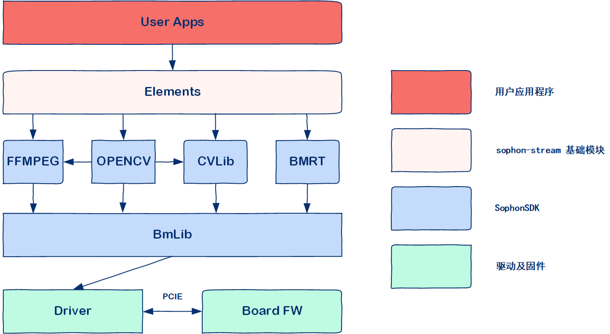
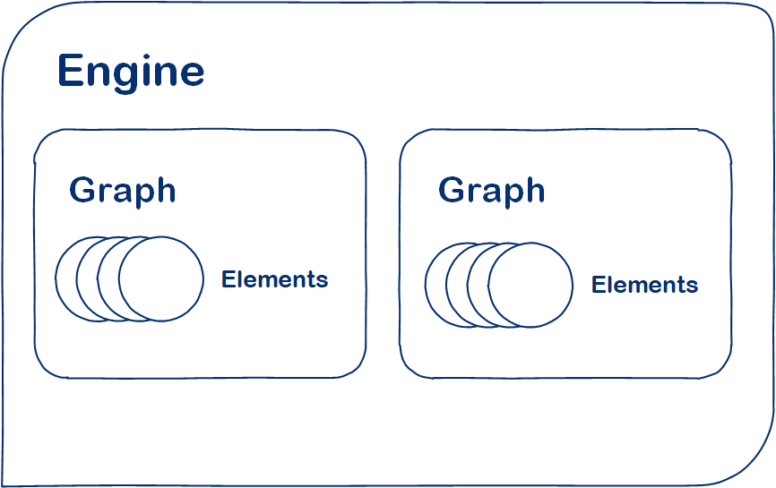

# 算能 sophon-stream 用户手册

## 目录
- [算能 sophon-stream 用户手册](#算能-sophon-stream-用户手册)
  - [目录](#目录)
  - [1. 快速入门](#1-快速入门)
    - [1.1 安装和配置环境](#11-安装和配置环境)
      - [1.1.1 x86/arm PCIe平台](#111-x86arm-pcie平台)
      - [1.1.2 SoC平台](#112-soc平台)
    - [1.2 编译命令](#12-编译命令)
      - [1.2.1 x86/arm PCIe平台](#121-x86arm-pcie平台)
      - [1.2.2 SoC平台](#122-soc平台)
    - [1.3 编译结果](#13-编译结果)
  - [2. 概述](#2-概述)
    - [2.1 sophon-stream优势](#21-sophon-stream优势)
    - [2.2 sophon-stream软件栈](#22-sophon-stream软件栈)
  - [3. 框架](#3-框架)
    - [3.1 Element](#31-element)
    - [3.2 Graph](#32-graph)
    - [3.3 Engine](#33-engine)
    - [3.4 Connector](#34-connector)
    - [3.5 ObjectMetadata](#35-objectmetadata)
    - [3.6 Frame](#36-frame)
  - [4. 插件](#4-插件)
    - [4.1 algorithm](#41-algorithm)
      - [4.1.1 概述](#411-概述)
      - [4.1.2 yolox](#412-yolox)
      - [4.1.3 yolov5](#413-yolov5)
      - [4.1.4 bytetrack](#414-bytetrack)
      - [4.1.5 openpose](#415-openpose)
      - [4.1.6 lprnet](#416-lprnet)
      - [4.1.7 retinaface](#417-retinaface)
    - [4.2 multimedia](#42-multimedia)
      - [4.2.1 decode](#421-decode)
      - [4.2.2 encode](#422-encode)
      - [4.2.3 osd](#423-osd)
    - [4.3 tools](#43-tools)
      - [4.3.1 distributor](#431-distributor)
      - [4.3.2 converger](#432-converger)
      - [4.3.3 blank](#433-blank)
      - [4.3.4 faiss](#434-faiss)
  - [5. 应用程序](#5-应用程序)
    - [5.1 例程概述](#51-例程概述)
    - [5.2 配置文件](#52-配置文件)
    - [5.3 入口程序](#53-入口程序)
    - [5.4 用户侧信息](#54-用户侧信息)
  - [6. 工具](#6-工具)
    - [6.1 web\_visualize简介](#61-web_visualize简介)
    - [6.2 功能介绍](#62-功能介绍)
    - [6.3 使用方法](#63-使用方法)

## 1. 快速入门

### 1.1 安装和配置环境

#### 1.1.1 x86/arm PCIe平台

如果您在x86/arm平台安装了PCIe加速卡（如SC系列加速卡），可以直接使用它作为开发环境和运行环境。您需要安装libsophon、sophon-opencv和sophon-ffmpeg，具体步骤可参考[x86-pcie平台的开发和运行环境搭建](EnvironmentInstallGuide.md#3-x86-pcie平台的开发和运行环境搭建)或[arm-pcie平台的开发和运行环境搭建](EnvironmentInstallGuide.md#5-arm-pcie平台的开发和运行环境搭建)。

#### 1.1.2 SoC平台

如果您使用SoC平台（如SE、SM系列边缘设备），刷机后在`/opt/sophon/`下已经预装了相应的libsophon、sophon-opencv和sophon-ffmpeg运行库包，可直接使用它作为运行环境。通常还需要一台x86主机作为开发环境，用于交叉编译C++程序。

### 1.2 编译命令

需要注意，如果您的主机上没有安装boost库，则需要使用如下命令进行安装。

```bash
sudo apt-get update 
sudo apt-get install libboost-all-dev
```

完成环境配置后，用户可以参考 [sophon-stream编译指南](./HowToMake.md)，使用如下命令编译。

* 需要注意，编译命令在sophon-stream目录下进行。

#### 1.2.1 x86/arm PCIe平台

```bash
mkdir build
cd build 
cmake ../ -DCMAKE_BUILD_TYPE=Debug -DTARGET_ARCH=pcie
make -j
```

#### 1.2.2 SoC平台

通常在x86主机上交叉编译程序，您需要在x86主机上使用SOPHON SDK搭建交叉编译环境，将程序所依赖的头文件和库文件打包至sophon_sdk_soc目录中，具体请参考[sophon-stream编译](./HowToMake.md)。本例程主要依赖libsophon、sophon-opencv和sophon-ffmpeg运行库包。

```bash
mkdir build
cd build 
cmake ../ -DCMAKE_BUILD_TYPE=Debug -DTARGET_ARCH=soc -DSOPHON_SDK_SOC=${path_to_sophon_soc_sdk}
make -j
```

注意：交叉编译时，${path_to_sophon_soc_sdk} 变量指运行交叉编译命令的x86主机上的arm sophon-sdk目录。

### 1.3 编译结果

sophon-stream中，除了sample以外的每个模块都以插件的形式参与运行。完成 [1.2 编译命令](#12-编译命令) 后，用户可以在 ./build/lib/ 目录下看到每个参与编译的插件对应的动态库文件。

samples中的源文件，其编译结果是可执行程序。例如，yolox例程的可执行程序位于 [yolox](../samples/yolox/build/yolox_demo) 。

## 2. 概述

sophon-stream是面向算丰开发平台的数据流处理工具。本软件基于插件化的思想，使用C++11开发了一套支持多路数据流并发处理的流水线框架。基于现有的接口，sophon-stream对用户具有易使用、易二次开发的优点，可以大大简化用户配置工程或添加插件的复杂度。sophon-stream基于SophonSDK，可以充分发挥算丰硬件的编解码能力及人工智能算法的推理能力，从而获得较高的性能。

### 2.1 sophon-stream优势

sophon-stream具有以下优点：
  
 - 稳健灵活的基础框架。在保证sophon-stream基础框架的稳健性的同时，它也具有相当大的灵活性。用户可以简单地配置json文件，从而准确方便地搭建复杂的业务流水线。
 - 完备的软硬件生态体系。sophon-stream基于算丰芯片的底层特点，包含了编解码硬件加速、常规的图像处理加速以及推理加速功能，可以充分发挥算丰芯片的性能优势，极大地提升整体的吞吐效率。
 - 丰富的算法库。sophon-stream支持多种目标检测及跟踪算法，例如yolox、yolov5、bytetrack等。
 - 便于部署。sophon-stream适用于算丰BM1684、BM1684X芯片，可以在PCIE、SOC模式下灵活部署。

### 2.2 sophon-stream软件栈

sophon-stream基于SophonSDK设计。SophonSDK是算能科技基于自主研发的 AI 芯片所定制的深度学习SDK，涵盖了神经网络推理阶段所需的模型优化、高效运行时支持等能力，为深度学习应用开发和部署提供易用、高效的全栈式解决方案。



sophon-stream由framework和element两部分组成，framework是整体的框架，作为底层决定了sophon-stream的运行方式，如图的构建、数据传输等。element是所有图节点的统称，它们由同一个抽象基类派生而来，负责基于SophonSDK提供某项特定功能，如视频编解码、图像处理等。

## 3. 框架

sophon-stream框架包含三层结构，分别是Engine，Graph和Element。三者之间的层次关系如下图所示。



Engine是sophon-stream中最外层的结构，向外部工程提供接口。Engine管理着多个Graph，而每个Graph是一张独立的有向无环图，管理着多个Element。

### 3.1 Element

element类是sophon-stream的通用基类，用户二次开发的插件也都基于element。作为一个抽象类，element类统一规定了所有派生类的主要接口和成员，包括数据如何传递、线程如何管理、两个element之间通过何种方式连接等。

一个element的结构如下图所示: 


Element与外部的数据传递通过connector来进行，每个输入或输出port都有一个connector与之对应。从输入connector获取数据之后，element在run()方法中调用doWork()来对数据进行处理，然后分发给outputPort对应的connector，即下一个element的输入connector。

element基类的主要成员变量:

```cpp
int mId;     // element id，用于在engine及graph中确定element的身份，在graph中具有唯一性
int mDeviceId;  // device id，涉及tpu操作时使用的设备id。pcie模式下可以按需设置，soc模式下应设置为0
int mThreadNumber; // element内部工作的线程数，也等于InputConnector中的DataPipe数目

// 管理输入和输出Connector的映射，key是输入或输出的port_id，value是指向Connector的指针
std::map<int, std::shared_ptr<framework::Connector>> mInputConnectorMap;
std::map<int, std::weak_ptr<framework::Connector>> mOutputConnectorMap;

/* 管理输出SinkHandler的映射，key是输出的port_id，value是一个签名为void(std::shared_ptr<void>)的函数。SinkHandler为graph末尾的元素提供数据处理功能，一般包括绘图等。 */
std::map<int, SinkHandler> mSinkHandlerMap;
```

主要的成员函数: 
```cpp
/* static方法，连接两个element。设置srcElement的输出port和dstElement的输入port，并把dstElement的inputConnector注册到srcElement的mOutputConnectorMap */
static void connect(Element& srcElement, int srcElementPort, Element& dstElement, int dstElementPort);

// 从配置文件初始化element的通用属性，例如element id、thread number等
common::ErrorCode init(const std::string& json)
// 启停element
common::ErrorCode start();
common::ErrorCode stop();
// push数据，用于启动DecoderElement的解码任务
common::ErrorCode pushInputData(int inputPort, int dataPipeId, std::shared_ptr<void> data);

// 线程函数，负责循环调用doWork()并分配CPU时间片资源
void run(int dataPipeId)

// 纯虚函数，派生类中用于初始化自定义的属性，例如算法相关内容
virtual common::ErrorCode initInternal(const std::string& json) = 0;

// 纯虚函数，派生类中自定义具体的算法逻辑，一般为[pop数据——组batch——运行算法——push数据]等
virtual common::ErrorCode doWork(int dataPipeId) = 0;
// 循环调用doWork()，线程资源调度
void run(int dataPipeId);

// 将已处理完的数据push到输出Connector。特别地，如果当前element是sink element，则执行SinkHandler。
common::ErrorCode pushOutputData(int outputPort, int dataPipeId, std::shared_ptr<void> data);
```

### 3.2 Graph

graph类的实例由engine管理，它提供接口给engine调用，主要在初始化或析构一张图时起作用。各graph可配置在不同设备运行，不推荐graph中各element配置在不同设备运行。graph类对外的接口主要包括：

```cpp
// 初始化及反初始化当前graph
common::ErrorCode init(const std::string& json);
void uninit();
// 启停当前graph
common::ErrorCode start();
common::ErrorCode stop();
// 向source element推入数据，用于启动DecoderElement的解码任务
common::ErrorCode pushSourceData(int elementId, int inputPort,
                                std::shared_ptr<void> data);
// 为sink element的sinkPort设置数据处理函数，例如绘图、发送等
void setSinkHandler(int elementId, int outputPort, SinkHandler sinkHandler);
```
### 3.3 Engine

engine类是一个单例，一个进程中只存在一个engine。engine类对外的接口主要包括：

```cpp
// 启停某个graph
common::ErrorCode start(int graphId);
common::ErrorCode stop(int graphId);
// 添加一个graph
common::ErrorCode addGraph(const std::string& json);
// 向某个graph中的source element推入数据。用于启动解码功能。
common::ErrorCode pushSourceData(int graphId, int elementId, int inputPort,
                                std::shared_ptr<void> data);
// 为某个graph的sink element的sinkPort设置数据处理函数，例如绘图、发送等。
void setSinkHandler(int graphId, int elementId, int outputPort,
                    SinkHandler sinkHandler);
```

### 3.4 Connector

Connector是在两个element之间传递数据的桥梁。一个connector的实例可以管理多个datapipe。

Connector类的主要成员如下: 

```cpp
class Connector : public ::sophon_stream::common::NoCopyable {
 public:
  
  // 获取编号为id的队列头部的数据，并将其弹出
  std::shared_ptr<void> popDataWithId(int id);
  
  // 将data push到编号为id的队列
  common::ErrorCode pushDataWithId(int id, std::shared_ptr<void> data);

  // 获取connector中队列的数目
  int getCapacity() const;
 private:
  
  // 多个DataPipe 
  std::vector<std::shared_ptr<DataPipe>> mDataPipes;
};
```

Connector类的成员方法都由id获取某个datapipe，然后调用该datapipe的对应方法来实现。
### 3.5 ObjectMetadata

ObjectMetadata是sophon-stream的通用数据结构，所有element中的功能都基于此结构设计。

ObjectMetadata的主要成员包括: 

```cpp
std::shared_ptr<common::Packet> mPacket; // 储存解码前信息
std::shared_ptr<common::Frame> mFrame;   // 储存解码后信息: bm_image、frame_id、EndOfStream标识等
std::shared_ptr<bmTensors> mInputBMtensors; // 当前frame经过预处理得到的inputTensor
std::shared_ptr<bmTensors> mOutputBMtensors; // 当前frame经过推理得到的outputTensor

// 嵌套的objectMetadata，储存当前图上的子结构
std::vector<std::shared_ptr<ObjectMetadata> > mSubObjectMetadatas; 
// detect相关信息，例如box坐标
std::shared_ptr<common::DetectedObjectMetadata> mDetectedObjectMetadata; 
// track相关信息，例如track_id
std::shared_ptr<common::TrackedObjectMetadata> mTrackedObjectMetadata;
```

### 3.6 Frame

Frame是ObjectMetadata中储存了图像信息的结构，其主要成员包括：

```cpp
int mChannelId;                         // 指定了推流服务中对应码流的url，不在配置文件中指定的情况下，默认从0开始赋值
int mChannelIdInternal;                 // 内部channel_id，从0开始赋值，用于计算connector中的数据流向
std::int64_t mFrameId;                  // 解码得到的帧id，在一路数据中递增
bool mEndOfStream;                      // 数据流结束的标识
std::shared_ptr<bm_image> mSpData;      // 存放原始bm_image
std::shared_ptr<bm_image> mSpDataOsd;   // 存放osd插件绘图之后的bm_image
```

## 4. 插件

sophon-stream中，所有算法或多媒体功能都以插件的形式存放于 sophon_stream/element/ 目录中。

sophon-stream/element/algorithm 目录是算法插件的集合，目前包括yolox、yolov5、bytetrack、resnet算法。

sophon-stream/element/multimedia 目录是多媒体插件的集合，目前包括编解码和OSD(On-Screen Display)功能。

sophon-stream/element/tools 目录是功能性插件的集合，目前包括数据分发、数据汇聚element，以及一个供用户进行调试的空白element。

### 4.1 algorithm

#### 4.1.1 概述

算法插件是基于SophonSDK中BMCV和BMRuntime库实现的具有图像处理和推理功能的模块，包括前处理、推理、后处理三个部分。用户根据业务需求，只需要载入对应的模型，即可调用硬件启动相应的功能。

算法插件具有以下特性：

 - element每个线程都与输入connector的一个datapipe绑定。组batch发生在doWork()函数的开始，从当前线程对应的datapipe中获取数据
 - 发送数据时，保证下游element各个线程负载均衡
 - 如果两个模块之间只有模型内部参数的差异，前处理、推理、后处理的流程完全相同时，可以复用前处理和后处理element
 - 支持将前处理、推理和后处理分别配置在不同的element上。如此配置的目的是充分利用cpu和tpu资源，提高算法效率

#### 4.1.2 yolox

yolox是旷视提出的目标检测算法，具有较高的性能。

yolox的配置文件形如：

```json
{
  "configure": {
    "model_path": "../data/models/BM1684X/yolox_s_int8_4b.bmodel",
    "threshold_conf": 0.5,
    "threshold_nms": 0.5,
    "bgr2rgb": true,
    "mean": [
      0,
      0,
      0
    ],
    "std": [
      1,
      1,
      1
    ],
    "stage": [
      "pre"
    ]
  },
  "shared_object": "../../../build/lib/libyolox.so",
  "id": 0,
  "device_id": 0,
  "name": "yolox",
  "side": "sophgo",
  "thread_number": 2
}
```
配置参数的详细介绍请参见 [yolox插件介绍](../element/algorithm/yolox/README.md)

yolox demo请参考 [yolox demo](../samples/yolox/README.md)

#### 4.1.3 yolov5

yolov5是世界上最受欢迎的视觉模型，使用十分广泛。

yolov5的配置文件形如：
```json
{
    "configure": {
        "model_path": "../data/models/BM1684X_tpukernel/yolov5s_tpukernel_int8_4b.bmodel",
        "threshold_conf": 0.5,
        "threshold_nms": 0.5,
        "bgr2rgb": true,
        "mean": [
            0,
            0,
            0
        ],
        "std": [
            1,
            1,
            1
        ],
        "stage": [
            "pre"
        ],
        "use_tpu_kernel": true
    },
    "shared_object": "../../../build/lib/libyolov5.so",
    "id": 0,
    "device_id": 0,
    "name": "yolov5",
    "side": "sophgo",
    "thread_number": 1
}
```

配置参数的详细介绍请参见 [yolov5插件介绍](../element/algorithm/yolov5/README.md)

yolov5 demo请参考 [yolov5 demo](../samples/yolov5/README.md)

#### 4.1.4 bytetrack

bytetrack是华中科技大学、香港大学和字节跳动联合提出的一个简单、快速、强大的多目标跟踪器。

其配置文件形如：
```json
{
    "configure": {
        "track_thresh": 0.5,
        "high_thresh": 0.6,
        "match_thresh": 0.7,
        "frame_rate": 30,
        "track_buffer": 30
    },
    "shared_object": "../../../build/lib/libbytetrack.so",
    "id": 0,
    "device_id": 0,
    "name": "bytetrack",
    "side": "sophgo",
    "thread_number": 2
}
```

配置参数的详细介绍请参见 [bytetrack插件介绍](../element/algorithm/bytetrack/README.md)

bytetrack demo请参考 [bytetrack demo](../samples/bytetrack/README.md)

#### 4.1.5 openpose

openpose是一个强大的姿态估计网络。

其配置文件形如：
```json
{
    "configure": {
        "model_path": "../data/models/BM1684X/pose_coco_int8_1b.bmodel",
        "threshold_nms": 0.05,
        "stage": [
            "pre"
        ]
    },
    "shared_object": "../../../build/lib/libopenpose.so",
    "name": "openpose",
    "side": "sophgo",
    "thread_number": 4
}
```

配置参数的详细介绍请参见 [openpose插件介绍](../element/algorithm/openpose/README.md)

openpose demo请参考 [openpose demo](../samples/openpose/README.md)

#### 4.1.6 lprnet

lprnet是一个用于车牌识别的网络。

其配置文件形如：
```json
{
  "configure": {
    "model_path": "../models/BM1684/lprnet_fp32_1b.bmodel",
    "stage": ["infer"]
  },
  "shared_object": "../../../build/lib/liblprnet.so",
  "name": "lprnet",
  "side": "sophgo",
  "thread_number": 4
}
```

配置参数的详细介绍请参见 [lprnet插件介绍](../element/algorithm/lprnet/README.md)

lprnet没有提供单独的demo，而是提供了一个yolov5车辆检测与lprnet车牌识别级联的demo。请参考 [license_plate_recognition demo](../samples/license_plate_recognition/README.md)

#### 4.1.7 retinaface

retinaface是一个用于人脸检测的网络。

其配置文件形如：
```json
{
    "configure": {
        "model_path": "../data/models/BM1684X/retinaface_mobilenet0.25_fp32_1b.bmodel",
        "max_face_count":50,
        "score_threshold":0.5,
        "bgr2rgb": false,
        "mean": [
            104,
            117,
            123
        ],
        "std": [
            1,
            1,
            1
        ],
        "stage": [
            "pre"
        ]
    },
    "shared_object": "../../../build/lib/libretinaface.so",
    "name": "retinaface",
    "side": "sophgo",
    "thread_number": 1
}
```

配置参数的详细介绍请参见 [retinaface插件介绍](../element/algorithm/retinaface/README.md)

retinaface没有提供单独的demo，而是提供了一个人脸检测与基于arcface与faiss的人脸识别的demo。请参考 [retinaface_distributor_resnet_faiss_converger demo](../samples/retinaface_distributor_resnet_faiss_converger/README.md)

### 4.2 multimedia

#### 4.2.1 decode

decode是sophon-stream的起始模块，起到从各种类型的输入获得ObjectMetadata，并发送往下游element的作用。

目前，DecoderElement支持的数据源类型包括: 
 - 本地视频文件
 - 本地图片文件夹
 - RTSP流
 - RTMP流

作为sophon-stream的起始模块，decode在触发任务时具有一定的特殊性。在graph构建完毕后，需要向decode element发送一个启动任务的信号，才会使decode开始工作，后续的element才有数据流入。

```cpp
nlohmann::json channel_config = yolox_json.channel_config;

channel_config["channel_id"] = channel_id;

auto channelTask = 
    std::make_shared<sophon_stream::element::decode::ChannelTask>();

channelTask->request.operation = 
    sophon_stream::element::decode::ChannelOperateRequest::ChannelOperate::START;

channelTask->request.json = channel_config.dump();

sophon_stream::common::ErrorCode errorCode = 
    engine.pushInputData(graph_id, 
                        src_id_port.first, 
                        src_id_port.second, 
                        std::static_pointer_cast<void>(channelTask));
```

可以看到，在构造channelTask时，还需要设置当前输入码流的channel_id。channel_id作为码流的标识，起到了确定ObjectMetadata在connector中流向的作用。

decode的配置文件包括以下内容: 

```json
{
  "configure": {},
  "shared_object": "../../../build/lib/libdecode.so",
  "id": 0,
  "device_id": 0,
  "name": "decode",
  "side": "sophgo",
  "thread_number": 1
}
```

配置参数的详细介绍请参见 [decode介绍](../element/multimedia/decode/README.md)

#### 4.2.2 encode

 encode一般作为sophon-stream的尾部模块使用，用于将处理后的图像信息编码为各类视频格式。

 目前，encode支持的目标类型包括: 
  - RTSP、RTMP、本地视频文件
  - H.264/H.265编码格式
  - I420、NV12等像素格式

encode的配置文件包括以下内容:

```json
{
  "configure": {
    "encode_type": "RTSP",
    "rtsp_port": "8554",
    "rtmp_port": "1935",
    "enc_fmt": "h264_bm",
    "pix_fmt": "I420"
  },
  "shared_object": "../../../build/lib/libencode.so",
  "id": 0,
  "device_id": 0,
  "name": "encode",
  "side": "sophgo",
  "thread_number": 4
}
```

配置参数的详细介绍请参见 [encode介绍](../element/multimedia/encode/README.md)

#### 4.2.3 osd

osd插件是可视化插件，目前支持目标检测、目标跟踪算法结果的可视化。

osd插件的配置文件包括:

```json
{
  "configure": {
    "osd_type": "TRACK",
    "class_names_file": "../data/coco.names"
  },
  "shared_object": "../../../build/lib/libosd.so",
  "id": 0,
  "device_id": 0,
  "name": "osd",
  "side": "sophgo",
  "thread_number": 1
}
```

其中，"osd_type" 字段标识了算法类型，可以设置为 "DET" 或 "TRACK" 

配置参数的详细介绍请参见 [osd介绍](../element/multimedia/osd/README.md)

### 4.3 tools

#### 4.3.1 distributor

distributor插件是数据分发插件，可以实现将检测到的不同类别目标分发到不同的下游分支的功能。目前，distributor支持的分发规则包括按时间间隔分发和按帧间隔分发两种，在配置具体的分发规则时，可以将上述两种方式搭配使用。

distributor的配置文件包括：

```json
{
    "configure": {
        "default_port": 0,
        "rules": [
            {
                "time_interval": 1,
                "routes": [
                    {
                        "classes":["car"],
                        "port": 1
                    },
                    {
                        "classes":["person"],
                        "port" : 2
                    }
                ]
            }
        ],
        "class_names_file": "../data/coco.names"
    },
    "shared_object": "../../../build/lib/libdistributor.so",
    "name": "distributor",
    "side": "sophgo",
    "thread_number": 1
}
```

distributor插件必须搭配converger插件使用，详细说明请参考[distributor介绍](../element/tools/distributor/README.md)

#### 4.3.2 converger

converger是数据汇聚插件，可以将经由distributor延伸的各分支element传来的数据进行汇总，然后输出到下游element。

converger的配置文件包括：

```json
{
    "configure": {
        "default_port": 0
    },
    "shared_object": "../../../build/lib/libconverger.so",
    "name": "converger",
    "side": "sophgo",
    "thread_number": 1
}
```

converger插件必须搭配distributor插件使用，详细说明请参考[converger介绍](../element/tools/converger/README.md)

#### 4.3.3 blank

blank是一个空白插件，可以连接在任意两个element之间，不会对pipeline有任何影响。

该插件提供了一个完整的插件模板，但没有实现任何配置参数或工作逻辑。用户可以自行编写相关代码，以起到调试等作用。

#### 4.3.4 faiss

faiss是一个数据库召回插件，在 BM1684X 上实现了Faiss::IndexFlatIP.search()。考虑 BM1684X 上 TPU 的连续内存, 针对 100W 底库, 可以在单芯片上一次查询最多约 512 个 256 维的输入。

## 5. 应用程序

基于sophon-stream创建应用程序，其实是基于sophon-stream的framework和element搭建业务流水线。

在实现了基础的算法功能之后，只需要编写配置文件和相应的入口程序，就可以完成流水线的搭建。

接下来，本文以一个典型的应用程序介绍配置文件和入口程序的编写要点。

### 5.1 例程概述

一个典型的pipeline一般包括如下操作:
  - 数据源解码
  - 目标检测
  - 目标跟踪
  - 绘制跟踪结果
  - 编码输出

本节以 [参考例程](../samples/yolox_bytetrack_osd_encode/src/yolox_bytetrack_osd_encode_demo.cc) 为例进行讲解。该例程构建的graph如下图所示:


### 5.2 配置文件

首先，需要配置上图中各个element的信息。在实际配置业务时，为了保证检测算法的效率，可以将检测算法的前处理、推理和后处理三个阶段分别配置在三个element上执行。本例程中采取这种配置方式，因此，该流水线包括decode、pre_process、inference、post_process、track、osd、encode共七个element。

该例程的配置文件包括：

```bash
./config/
├── bytetrack.json                          # 跟踪
├── decode.json                             # 解码
├── encode.json                             # 编码
├── engine.json                             # graph的总体配置
├── osd.json                                # osd模块
├── yolox_bytetrack_osd_encode_demo.json    # demo的总体配置
├── yolox_infer.json                        # yolox推理
├── yolox_post.json                         # yolox后处理
└── yolox_pre.json                          # yolox预处理
```

其中，各个element的配置文件在上文对应的章节已经进行了阐述，这里对demo和graph配置文件中的内容进行说明。

yolox_bytetrack_osd_encode_demo.json 是该demo的总体配置，其形如：

```json
{
  {
  "channels": [
    {
      "channel_id": 2,
      "url": "../data/videos/mot17_01_frcnn.mp4",
      "source_type": "VIDEO"
    },
    {
      "channel_id": 3,
      "url": "../data/videos/mot17_03_frcnn.mp4",
      "source_type": "VIDEO"
    }
  ],
  "engine_config_path": "../config/engine.json"
}
}
```

demo的配置文件包括两个属性。一是`channels` ，在一个list中记录所有输入的`url`、`channel_id`和`source_type`信息。需要注意的是：`source_type`需要参考 [decode配置](../element/multimedia/decode/README.md) 准确设置。

该配置文件中，`channel_id`标记了encode插件启动推流服务器时，输出视频流的URL。推流URL配置请参考 [#4.2.2 encode](#422-encode)。如果不需要该功能，可以参考 [yolov5 demo](../samples/yolov5/src/yolov5_demo.cc) 及 [yolov5 配置文件](../samples/yolov5/config/yolov5_demo.json)，不设置`channel_id`，在demo中默认从0开始赋值。

engine.json 是当前demo程序中构造的graph信息，储存了每个graph内包含的element及element之间如何连接等信息。其形如：

```json
[
    {
        "graph_id": 0,
        "graph_name": "yolox",
        "elements": [
            {
                "element_id": 5000,
                "element_config": "../config/decode.json",
                "ports": {
                    "input": [
                        {
                            "port_id": 0,
                            "is_sink": false,
                            "is_src": true
                        }
                    ],
                    "output": [
                        {
                            "port_id": 0,
                            "is_sink": false,
                            "is_src": false
                        }
                    ]
                }
            },
            {
                "element_id": 5001,
                "element_config": "../config/yolox_pre.json",
                "ports": {
                    "input": [
                        {
                            "port_id": 0,
                            "is_sink": false,
                            "is_src": false
                        }
                    ],
                    "output": [
                        {
                            "port_id": 0,
                            "is_sink": true,
                            "is_src": false
                        }
                    ]
                }
            }
        ],
        "connections": [
            {
                "src_element_id": 5000,
                "src_port": 0,
                "dst_element_id": 5001,
                "dst_port": 0
            }
        ]
    }
]
```

其中，需要重点关注的是 "elements" 和 "connections" 部分。"elements" 是graph内所有element的列表，对于每个element，需要配置element_id、对应的配置文件路径和端口信息。同一个graph内不同的element应具有不同的element_id。element的端口包括输入和输出端口，同一种类的不同端口之间同样应该由不同的port_id区分开。每个端口都具有 "is_src" 和 "is_sink" 属性，标志着当前是否是整张graph的输入或输出端口。

一般只有decode element才会具有输入端口，decode element在一张图中只有一个。对于此element，需要在应用程序中为其发送channelTask，以启动pipeline的工作。不同的是，输出端口不要求element的类型，任何element都可以具有输出端口，具体应该参考工程需求进行配置。对于具有输出端口的element，应为其设置SinkHandler，即正确处理输出数据的回调函数。

### 5.3 入口程序

对于不同的demo，其差异主要在配置文件方面，入口程序基本是一致的。

入口程序一般包括以下几个部分：

 - 解析demo的配置文件
 - 解析engine的配置文件
 - 调用engine.addGraph()，初始化所有element及其connection
 - 设置sink element的SinkHandler
 - 发送channelTask，触发decode element的工作任务
 - 等候所有码流处理完毕，结束任务
 - 统计fps等信息

### 5.4 用户侧信息

运行一个例程时，命令行中会依序打印如下信息：

 - graph的配置信息
 ```bash
 [info] [/sophon-stream/framework/src/engine.cc:95] Add graph start, json: {"connections":[{"dst_id":5001,"dst_port":0,"src_id":5000,"src_port":0},{"dst_id":5002,"dst_port":0,"src_id":5001,"src_port":0},{"dst_id":5003,"dst_port":0,"src_id":5002,"src_port":0}],"elements":[{"configure":{},"device_id":0,"id":5000,"name":"decode","shared_object":"../../../build/lib/libdecode.so","side":"sophgo","thread_number":1},{"configure":{"model_path":"../data/models/BM1684X/yolox_s_int8_4b.bmodel","stage":["pre"],"threshold_conf":0.5,"threshold_nms":0.5},"device_id":0,"id":5001,"name":"yolox","shared_object":"../../../build/lib/libyolox.so","side":"sophgo","thread_number":2},{"configure":{"model_path":"../data/models/BM1684X/yolox_s_int8_4b.bmodel","stage":["infer"],"threshold_conf":0.5,"threshold_nms":0.5},"device_id":0,"id":5002,"name":"yolox","shared_object":"../../../build/lib/libyolox.so","side":"sophgo","thread_number":2},{"configure":{"model_path":"../data/models/BM1684X/yolox_s_int8_4b.bmodel","stage":["post"],"threshold_conf":0.5,"threshold_nms":0.5},"device_id":0,"id":5003,"is_sink":true,"name":"yolox","shared_object":"../../../build/lib/libyolox.so","side":"sophgo","thread_number":2}],"graph_id":0}
 ```

 - element的配置信息

 ```bash
 [info] [/sophon-stream/framework/src/element.cc:45] Init start, json: {"configure":{"model_path":"../data/models/BM1684X/yolox_s_int8_4b.bmodel","stage":["pre"],"threshold_conf":0.5,"threshold_nms":0.5},"device_id":0,"id":5001,"name":"yolox","shared_object":"../../../build/lib/libyolox.so","side":"sophgo","thread_number":2}
[BMRT][bmcpu_setup:349] INFO:cpu_lib 'libcpuop.so' is loaded.
bmcpu init: skip cpu_user_defined
open usercpu.so, init user_cpu_init
[BMRT][load_bmodel:1079] INFO:Loading bmodel from [../data/models/BM1684X/yolox_s_int8_4b.bmodel]. Thanks for your patience...
[BMRT][load_bmodel:1023] INFO:pre net num: 0, load net num: 1
*** Run in PCIE mode ***

########################
NetName: yolox_s_bmnetp
---- stage 0 ----
  Input 0) 'x.1' shape=[ 4 3 640 640 ] dtype=INT8 scale=0.498161
  Output 0) '15' shape=[ 4 8400 85 ] dtype=FLOAT32 scale=1
########################
 ```

 - connection信息

 ```bash
 [debug] [/sophon-stream/framework/src/element.cc:26] InputConnector initialized, mId = 5001, inputPort = 0, dataPipeNum = 2
 ```

 - 启动graph、element

 ```bash
[info] [/sophon-stream/framework/src/graph.cc:107] Start graph thread start, graph id: 0
[info] [/sophon-stream/framework/src/element.cc:125] Start element thread start, element id: 5000
[info] [/sophon-stream/framework/src/element.cc:140] Start element thread finish, element id: 5000
[info] [/sophon-stream/framework/src/element.cc:125] Start element thread start, element id: 5001
[info] [/sophon-stream/framework/src/element.cc:140] Start element thread finish, element id: 5001
[info] [/sophon-stream/framework/src/element.cc:125] Start element thread start, element id: 5002
[info] [/sophon-stream/framework/src/element.cc:140] Start element thread finish, element id: 5002
[info] [/sophon-stream/framework/src/element.cc:125] Start element thread start, element id: 5003
[info] [/sophon-stream/framework/src/element.cc:140] Start element thread finish, element id: 5003
[info] [/sophon-stream/framework/src/graph.cc:127] Start graph thread finish, graph id: 0
 ```

 - 设置sink handler

 ```bash
 [info] [/sophon-stream/framework/src/engine.cc:143] Set sink handler, graph id: 0, element id: 5003, output port: 0
 ```

 - 设置channel_task，启动decode

 ```bash
 [info] [/sophon-stream/element/multimedia/decode/src/decode.cc:127] add one channel task
 [info] [/sophon-stream/element/multimedia/decode/src/decode.cc:163] channel info decoder address: 0x7f7814000b70
 ```

 - element工作状态

```bash
[engine] [debug] [/sophon-stream/framework/src/element.cc:232] send data, element id: 5000, output port: 0, data:0x7f781cab01d0
[engine] [debug] [/sophon-stream/framework/src/element.cc:232] send data, element id: 5000, output port: 0, data:0x7f781cad9110
[engine] [debug] [/sophon-stream/framework/src/element.cc:232] send data, element id: 5000, output port: 0, data:0x7f781c0681b0
[engine] [debug] [/sophon-stream/framework/src/element.cc:232] send data, element id: 5002, output port: 0, data:0x7f781c0127d0
[engine] [debug] [/sophon-stream/framework/src/element.cc:232] send data, element id: 5002, output port: 0, data:0x7f781c067480
[engine] [debug] [/sophon-stream/framework/src/element.cc:232] send data, element id: 5002, output port: 0, data:0x7f781c0daf90
```

 - 解码至文件尾

 ```bash
 [h264_bm @ 0x7f7814007f80] av_read_frame ret(-541478725) maybe eof...
 ```
 - engine、graph、element线程终止
 ```bash
 [engine] [info] [/sophon-stream/framework/src/engine.cc:35] Engine stop graph thread start, graph id: 0
 [engine] [info] [/sophon-stream/framework/src/engine.cc:50] Engine stop graph thread finish, graph id: 0
 [engine] [info] [/sophon-stream/framework/src/graph.cc:132] Stop graph thread start, graph id: 0
 [engine] [info] [/sophon-stream/framework/src/element.cc:145] Stop element thread start, element id: 5000
 [engine] [info] [/sophon-stream/element/multimedia/decode/src/decode.cc:52] Decode stop...
 [engine] [info] [/sophon-stream/framework/src/element.cc:159] Stop element thread finish, element id: 5000
 [engine] [info] [/sophon-stream/framework/src/element.cc:145] Stop element thread start, element id: 5001
 [engine] [info] [/sophon-stream/framework/src/element.cc:159] Stop element thread finish, element id: 5001
 [engine] [info] [/sophon-stream/framework/src/element.cc:145] Stop element thread start, element id: 5002
 [engine] [info] [/sophon-stream/framework/src/element.cc:159] Stop element thread finish, element id: 5002
 [engine] [info] [/sophon-stream/framework/src/element.cc:145] Stop element thread start, element id: 5003
 [engine] [info] [/sophon-stream/framework/src/element.cc:159] Stop element thread finish, element id: 5003
 [engine] [info] [/sophon-stream/framework/src/graph.cc:150] Stop graph thread finish, graph id: 0
 ```

 - 统计耗时、帧数、fps

```bash
total time cost 5286871 us.
frame count is 1422 | fps is 268.968 fps.
```

## 6. 工具

### 6.1 web_visualize简介

web_visualize是针对sophon-stream项目运行的可视化工具。本工具能够将项目的运行结果在前端可视化，使得用户能够实时了解到项目的推理结果。通过该工具，用户可以在前端实时查看项目的推理结果，直观了解每个阶段的处理情况和输出。这种交互性的可视化方式为项目的调试和优化提供了极大的便利，使得非技术人员也能轻松使用。

目前，web_visualize总共包含两个子目录，一个子目录是web_server，为项目的后端程序，另外一个子目录是web_ui，为项目的前端程序。具体的启动方法及项目简介请参阅后续的[快速入门文档](../tools/web_visualize/README.md)，其中将详细说明如何逐步完成前后端的启动过程。

### 6.2 功能介绍
web_visualize可视化工具为用户提供以下几种功能：

   - 图形化的操作和配置界面：
  
     我们为每个pipeline都提供了内置的pipeline示例配置，您可以直接运行示例，快速体验sophon-stream。
   
   - 支持修改不同pipeline参数：
     
     我们支持在线配置pipeline的各种参数，您可以直接点击选择不同的配置文件，在线提交。
   
   - 支持预览pipeline运行结果： 
   
     支持预览实时运行中的视频结果；

### 6.3 使用方法
使用本项目工具，请依次启动`web_server`后端程序和`web_ui`前端程序，请依次参考下列入门使用方法：

首先请参考后端程序的入门使用方法，将后端程序开启，请参考[web_server使用手册](../tools/web_visualize/web_server/README.md)。

然后请参考前端程序的入门使用方法，将前端程序开启，请参考[web_ui使用手册](../tools/web_visualize/web_ui/README.md)。