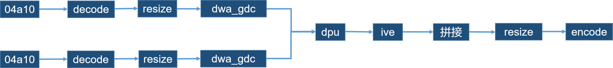

# dwa_dpu_encode Demo

## 目录
- [dwa\_dpu\_encode Demo](#dwa_dpu_encode-demo)
  - [目录](#目录)
  - [1. 简介](#1-简介)
  - [2. 特性](#2-特性)
  - [3. 准备数据](#3-准备数据)
  - [4. 环境准备](#4-环境准备)
    - [4. SoC平台](#4-soc平台)
  - [5. 程序编译](#5-程序编译)
    - [5.1 SoC平台](#51-soc平台)
  - [6. 程序运行](#6-程序运行)
    - [6.1 Json配置说明](#61-json配置说明)
    - [6.2 运行](#62-运行)
  - [7. 性能测试](#7-性能测试)
  - [8. web ui使用](#8-web-ui使用)
    - [8.1 安装nodejs](#81-安装nodejs)
    - [8.2 web ui编译](#82-web-ui编译)
    - [8.3 运行web ui](#83-运行web-ui)

## 1. 简介

本例程用于说明如何使用sophon-stream快速构建深度估计应用。

本例程中，深度估计算法的镜头畸变矫正、深度估计、染色分别在三个element上进行运算，element内部可以开启多个线程，保证了一定的运行效率。下图是深度估计应用的流程图：


## 2. 特性

* 支持BM1688(SoC)
* 支持多路视频流
* 支持多线程

## 3. 准备数据

​在`scripts`目录下提供了相关数据的下载脚本 [download.sh](./scripts/download.sh)。

```bash
# 安装unzip，若已安装请跳过，非ubuntu系统视情况使用yum或其他方式安装
sudo apt install unzip
chmod -R +x scripts/
./scripts/download.sh
```

脚本执行完毕后，会在当前目录下生成`data`目录，其中包含`models`和`videos`两个子目录。
```bash
.
├── gridinfo # 用于dwa模块的参数文件
├── images   # 测试图片
├── maps     # 用于ive模块的染色文件
└── videos   # 测试视频
```

## 4. 环境准备

### 4. SoC平台

如果您使用SoC平台（如SE、SM系列边缘设备），刷机后在`/opt/sophon/`下已经预装了相应的libsophon、sophon-opencv和sophon-ffmpeg运行库包，可直接使用它作为运行环境。通常还需要一台x86主机作为开发环境，用于交叉编译C++程序。
(1) 安装驱动
安装驱动需要进入到超级权限，接着系统驱动目录，安装驱动：
```bash
sudo -s
insmod /mnt/system/ko/v4l2_os04a10_sync.ko
```

（2）isp参数文件配置,需要在当前dwa_dpu_encode目录下

```bash
sudo -s
mkdir -p /mnt/cfg/param
cp ./data/cvi_sdr_bin /mnt/cfg/param/
```
备注：如需标定，请参考[摄像头标定](Calibration.md)
## 5. 程序编译

### 5.1 SoC平台
通常在x86主机上交叉编译程序，您需要在x86主机上使用SOPHON SDK搭建交叉编译环境，将程序所依赖的头文件和库文件打包至sophon_sdk_soc目录中，具体请参考[sophon-stream编译](../../docs/HowToMake.md)。本例程主要依赖libsophon、sophon-opencv和sophon-ffmpeg运行库包。

## 6. 程序运行

### 6.1 Json配置说明

dwa_dpu_encode demo中各部分参数位于 [config](./config/) 目录，结构如下所示：

```bash
./config/
├── decode.json                 # 解码配置
├── encode.json                 # 编码配置
├── engine_dwa_dpu_ive_resize.json          # sophon-stream graph配置，需要分别配置dwa、dpu、ive_resize、encode等文件
├── dwa_dpu_encode_demo_imgs.json           # demo按图片输入的配置文件
├── camera_dwa_dpu_encode_demo.json        # demo按sensor输入的配置文件
├── dwa_L.json                  # 左侧输入对应的畸变矫正配置文件
├── dwa_R.json                  # 右侧输入对应的畸变矫正配置文件
├── dpu.json                    # 深度估计配置文件
├── resize.json                 # 尺寸缩放配置文件
└── ive.json                    # 深度估计配置文件

```

其中，[camera_dwa_dpu_encode_demo.json](./config/camera_dwa_dpu_encode_demo.json)是例程的整体配置文件，管理输入码流等信息。在一张图上可以支持多路数据的输入，channels参数配置输入的路数，sample_interval设置跳帧数，loop_num设置循环播放次数，channel中包含码流url等信息。此例程不支持download选项。

配置文件中不指定`channel_id`属性的情况，会在demo中对每一路数据的`channel_id`从0开始默认赋值。


### 6.2 运行

对于SoC平台，需将交叉编译生成的动态链接库、可执行文件、所需的模型和测试数据拷贝到SoC平台中测试。

SoC平台上，动态库、可执行文件、配置文件、模型、视频数据的目录结构关系应与原始sophon-stream仓库中的关系保持一致。


1. 运行可执行文件,sensor的出图需要root权限
```bash
./main --demo_config_path=../dwa_dpu_encode/config/camera_dwa_dpu_encode_demo.json
```

## 7. 性能测试

目前，深度估计算法只支持在BM1688 SOC模式下进行推理。按sensor输入按照默认设置可以达到30fps。可通过运行中打印的log确认fps是否正常。


## 8. web ui使用
### 8.1 安装nodejs

访问https://nodejs.org/en/download/，根据说明完成nodejs的安装，推荐使用node-v20.11.1版本。

### 8.2 web ui编译

进入sophon-stream/sample/dwa_dpu_encode/web/ui目录，执行以下命令：
```bash
npm install --force
npm run build
```
编译完成后会在该目录下产生build文件夹。最后，将编译生成的文件拷贝到SoC平台中运行。
### 8.3 运行web ui

进入sophon-stream/sample/dwa_dpu_encode/web/ui/build目录，执行以下命令：
```bash
python3 -m http.server 3000
```
其中，3000是web ui的端口号，可以根据需要修改。
在浏览器中访问http://localhost:3000/，即可打开web ui界面。（localhost更改为运行环境的ip）

备注：

1.注意本例程web界面使用dpu选项，不支持blend选项

2.推荐使用google或者edge浏览器，不推荐firefox浏览器