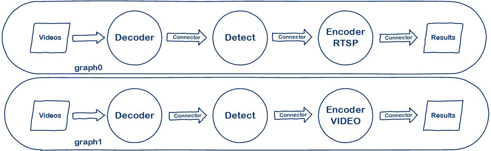

# Multi-Graph Demo

[Englist](README_EN.md) | 简体中文

## 目录
- [Multi-Graph Demo](#Multi-Graph demo)
  - [目录](#目录)
  - [1. 简介](#1-简介)
  - [2. 特性](#2-特性)
  - [3. 准备模型与数据](#3-准备模型与数据)
  - [4. 运行](#4-运行)

## 1. 简介

本例程用于说明如何使用sophon-stream搭建多graph应用。

一般来说，sophon-stream的一个graph上所有输入码流只支持在相同的设备上执行相同的算法流程。因此当遇到不同码流需要做不同计算，或者不同码流在不同的设备上运行时，需要使用多graph来配置。

这里提供了一个简单的示例，Engine中包含两个Graph。Graph0流程为解码-检测-编码RTSP；Graph1流程为解码-检测-编码本地视频文件。

本例程插件连接方式如下图所示



## 2. 特性

* 支持BM1684X、BM1684(x86 PCIe、SoC)，支持BM1688(SoC)
* BM1684X平台上，支持tpu_kernel后处理
* 支持多路视频流
* 支持多线程

## 3. 准备模型与数据

本例程使用的数据来自yolov5例程，请参考[yolov5](../yolov5/README.md)下载数据

## 4. 运行

对于PCIe平台，可以直接在PCIe平台上运行测试；对于SoC平台，需将交叉编译生成的动态链接库、可执行文件、所需的模型和测试数据拷贝到SoC平台中测试。

SoC平台上，动态库、可执行文件、配置文件、模型、视频数据的目录结构关系应与原始sophon-stream仓库中的关系保持一致。

测试的参数及运行方式是一致的，下面主要以PCIe模式进行介绍。

1. 运行可执行文件
```bash
./main --demo_config_path=../multi_graph/config/mult_graph_demo.json
```