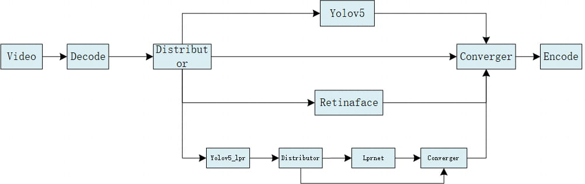
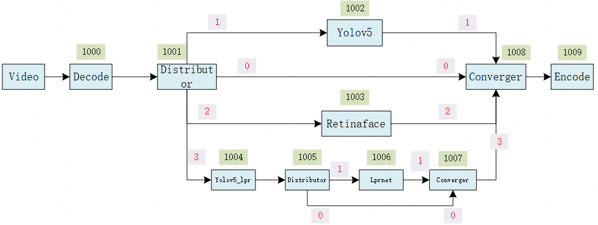
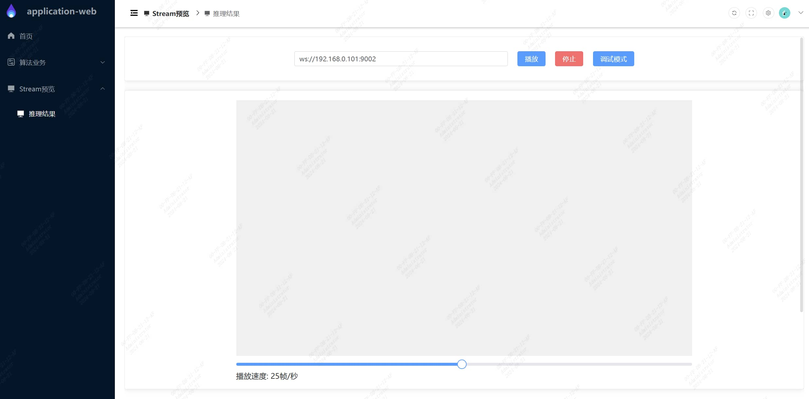
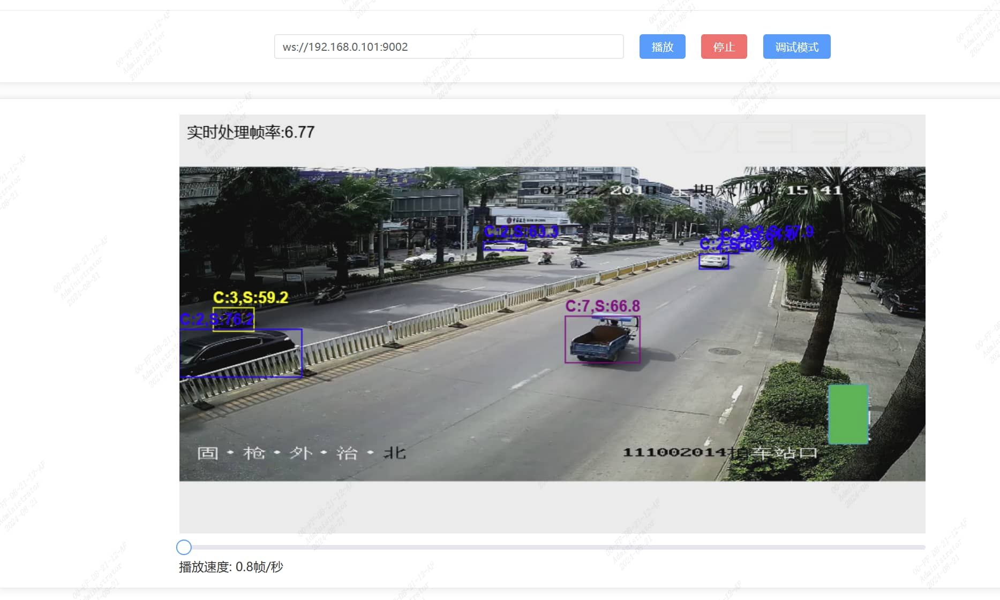
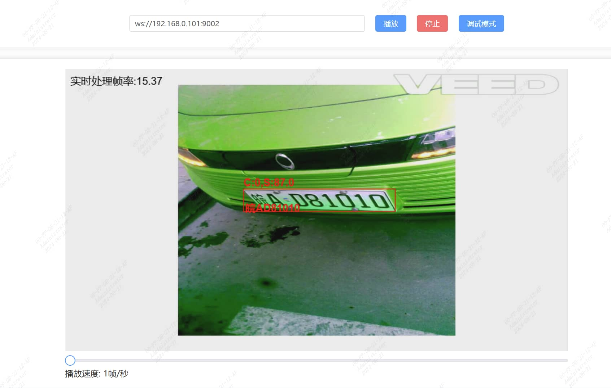
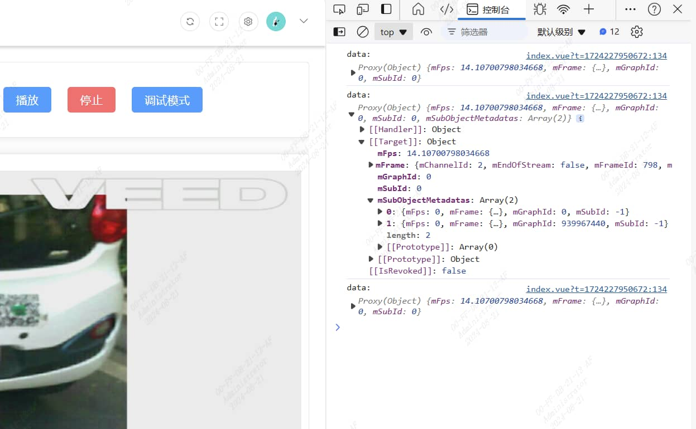

# structured_recognition Demo

[English](README_EN.md) | 简体中文

## 目录

- [structured\_recognition Demo](#structured_recognition-demo)
  - [目录](#目录)
  - [1. 简介](#1-简介)
  - [2. 特性](#2-特性)
  - [3. 准备模型与数据](#3-准备模型与数据)
  - [4. 环境准备](#4-环境准备)
    - [4.1 x86/arm PCIe 平台](#41-x86arm-pcie-平台)
    - [4.2 SoC 平台](#42-soc-平台)
    - [4.3 在SoC平台安装可视化工具](#43-在soc平台安装可视化工具)
  - [5. 程序编译](#5-程序编译)
    - [5.1 x86/arm PCIe 平台](#51-x86arm-pcie-平台)
    - [5.2 SoC 平台](#52-soc-平台)
  - [6. 程序运行](#6-程序运行)
    - [6.1 Json 配置说明](#61-json-配置说明)
    - [6.2 运行](#62-运行)
  - [7. 性能测试](#7-性能测试)

## 1. 简介

本例程用于说明如何使用 sophon-stream 将一路码流分发给多个算法模块，快速构建一个结构化识别算法应用（机动车、非机动车、人、人脸、车牌）。  
本例程插件连接方式如下图所示。  
将一路video视频解码后，通过distributor插件分发给3个算法，yolov5进行人、机动车、非机动车识别，retinaface进行人脸识别，license_plate_recognition进行车牌识别。 
  
本例程使用的模型来自[yolov5](../yolov5/README.md)、[retinaface](../retinaface/README.md)、[license_plate_recognition](../license_plate_recognition/README.md)例程

## 2. 特性

- 支持 BM1684X、BM1684(x86 PCIe、SoC)、BM1688(SoC)
- 支持多个算法检测一路视频流
- 支持多线程

## 3. 准备模型与数据

​ 在`scripts`目录下提供了相关模型和数据的下载脚本 [download.sh](./scripts/download.sh)。

```bash
chmod -R +x scripts/
./scripts/download.sh
```

脚本执行完毕后，会在当前目录下生成`data`目录，其中，`coco_lpr.names`为车牌检测yolov5s模型的分类集，`coco.names`为常规yolov5s模型的分类集，`models`存放模型文件。

下载的模型和数据包括：

```bash
.
├── data
│   ├── coco_lpr.names
│   ├── coco.names
│   ├── models
│   │   ├── lprnet
│   │   │   ├── BM1684
│   │   │   │   └── lprnet_int8_1b.bmodel
│   │   │   ├── BM1684X
│   │   │   │   └── lprnet_int8_1b.bmodel
│   │   │   └── BM1688
│   │   │       └── lprnet_int8_1b.bmodel
│   │   ├── retinaface
│   │   │   ├── BM1684
│   │   │   │   └── retinaface_mobilenet0.25_int8_1b.bmodel
│   │   │   ├── BM1684X
│   │   │   │   └── retinaface_mobilenet0.25_int8_1b.bmodel
│   │   │   └── BM1688
│   │   │       ├── retinaface_mobilenet0.25_int8_1b_2core.bmodel
│   │   │       └── retinaface_mobilenet0.25_int8_1b.bmodel
│   │   ├── yolov5s
│   │   │   ├── BM1684
│   │   │   │   └── yolov5s_v6.1_3output_int8_1b.bmodel
│   │   │   ├── BM1684X
│   │   │   │   └── yolov5s_v6.1_3output_int8_1b.bmodel
│   │   │   └── BM1688
│   │   │       ├── yolov5s_v6.1_3output_int8_1b_2core.bmodel
│   │   │       └── yolov5s_v6.1_3output_int8_1b.bmodel
│   │   └── yolov5s-licensePLate
│   │       ├── BM1684
│   │       │   └── yolov5s_v6.1_license_3output_int8_1b.bmodel
│   │       ├── BM1684X
│   │       │   └── yolov5s_v6.1_license_3output_int8_1b.bmodel
│   │       └── BM1688
│   │           ├── yolov5s_v6.1_license_3output_int8_1b_2core.bmodel
│   │           └── yolov5s_v6.1_license_3output_int8_1b.bmodel
│   └── videos
│       └── structs.mp4
└── tools
    └── application-web-linux_arm64.tgz
```
其中application-web-linux_arm64.tgz是在SoC平台运行的web可视化工具。

模型及数据说明: 为方便下载和测试，本例程仅采用int8精度模型，如需其他精度模型，可在[yolov5](../yolov5/README.md)、[retinaface](../retinaface/README.md)、[license_plate_recognition](../license_plate_recognition/README.md)例程下载。

数据包括：类别集合coco_lpr.names、coco.names以及测试视频structs.mp4


## 4. 环境准备

### 4.1 x86/arm PCIe 平台

如果您在 x86/arm 平台安装了 PCIe 加速卡（如 SC 系列加速卡），可以直接使用它作为开发环境和运行环境。您需要安装 libsophon、sophon-opencv 和 sophon-ffmpeg，具体步骤可参考[x86-pcie 平台的开发和运行环境搭建](../../docs/EnvironmentInstallGuide.md#3-x86-pcie平台的开发和运行环境搭建)或[arm-pcie 平台的开发和运行环境搭建](../../docs/EnvironmentInstallGuide.md#5-arm-pcie平台的开发和运行环境搭建)。

### 4.2 SoC 平台

如果您使用 SoC 平台（如 SE、SM 系列边缘设备），刷机后在`/opt/sophon/`下已经预装了相应的 libsophon、sophon-opencv 和 sophon-ffmpeg 运行库包，可直接使用它作为运行环境。通常还需要一台 x86 主机作为开发环境，用于交叉编译 C++程序。

### 4.3 在SoC平台安装可视化工具
在SoC平台依次执行安装命令：
```bash
tar -xzvf application-web-linux_arm64.tgz 
cd application_web/
sudo ./install.sh
```
安装完成后，使用浏览器输入`http://{ip}:8089`，打开页面，ip为SoC平台设备ip地址。用户名和密码均为`admin`  

## 5. 程序编译

### 5.1 x86/arm PCIe 平台

可以直接在 PCIe 平台上编译程序，具体请参考[sophon-stream 编译](../../docs/HowToMake.md)。

### 5.2 SoC 平台

通常在 x86 主机上交叉编译程序，您需要在 x86 主机上使用 SOPHON SDK 搭建交叉编译环境，将程序所依赖的头文件和库文件打包至 sophon_sdk_soc 目录中，具体请参考[sophon-stream 编译](../../docs/HowToMake.md)。本例程主要依赖 libsophon、sophon-opencv 和 sophon-ffmpeg 运行库包。

## 6. 程序运行

### 6.1 Json 配置说明

structured_recognition demo 中各部分参数位于 [config](./config/) 目录，结构如下所示：

```bash
config/
├── converger.json
├── decode.json
├── distributor_frame.json
├── distributor_time_class.json
├── encode.json
├── engine_group.json
├── lprnet_group.json
├── retinaface_group.json
├── structured_recognition_demo.json
├── yolov5_group.json
└── yolov5_lpr_group.json
```


[engine_group.json](./config/engine_group.json)是例程的整体配置文件，管理输入码流等信息。在一张图上可以支持多路数据的输入，以及一路码流分配给多个算法检测。

在该文件内，需要初始化每个 element 的信息和 element 之间的连接方式。element_id 是唯一的，起到标识身份的作用。element_config 指向该 element 的详细配置文件地址，port_id 是该 element 的输入输出端口编号，多输入或多输出的情况下，输入/输出编号也不可以重复。is_src 标志当前端口是否是整张图的输入端口，is_sink 标识当前端口是否是整张图的输出端口。
connection 是所有 element 之间的连接方式，通过 element_id 和 port_id 确定。  

[engine_group.json](./config/engine_group.json)的配置如图所示：   
  
其中1000-1009为每个`element`的id，配置文件中的`connections`表示连接`element`的箭头，每个`element`默认端口都为0；由于`distributor`需要将一帧图片分发给多个`element`，因此除了默认端口0以外，还有端口1-3，上图中，红色数字标注为`distributor`和`converger`插件的端口；`converger`插件是配合`distributor`实现数据汇集功能，接受端口需要和`distributor`发送的端口保持一致。  
最后通过`encode`插件将数据转为json格式，通过websock方式推流。


### 6.2 运行

对于 PCIe 平台，可以直接在 PCIe 平台上运行测试；对于 SoC 平台，需将交叉编译生成的动态链接库、可执行文件、所需的模型和测试数据拷贝到 SoC 平台中测试。

SoC 平台上，动态库、可执行文件、配置文件、模型、视频数据的目录结构关系应与原始 sophon-stream 仓库中的关系保持一致。

测试的参数及运行方式是一致的，下面主要以 PCIe 模式进行介绍。

1. 运行可执行文件
```bash
./main --demo_config_path=../structured_recognition/config/structured_recognition_demo.json
```
2. 打开可视化工具  
打开推理结果页面，输入websock链接，格式为`ws://{ip}:{port}`,如`ws://192.168.0.101:9002`，其中端口值是由[encode.json](./config/encode.json)文件中`wss_port`字段决定，比如`wss_port`值为9000，[engine_group.json](./config/engine_group.json)中`channel_id`为2，那么这一路视频流结果地址就是9002。
<div style="text-align: center;">
  
</div>
点击播放，即可播放检测结果的图片流。
<div style="text-align: center;">
  
</div>
<div style="text-align: center;">
  
</div>
点击调试模式，可以在浏览器控制台打印每一帧结果的内容，可查看上报数据的json格式  
<div style="text-align: center;">
  
</div>  


## 7. 性能测试

由于全流程依赖输入视频fps且ws上传速度慢，本例程暂不提供性能测试结果，如需各模型推理性能，请到对应模型例程查看。

**注意** encode插件会将图片进行base64编码，速度比较慢；如果去掉encode插件，可跑满源视频的30fps。