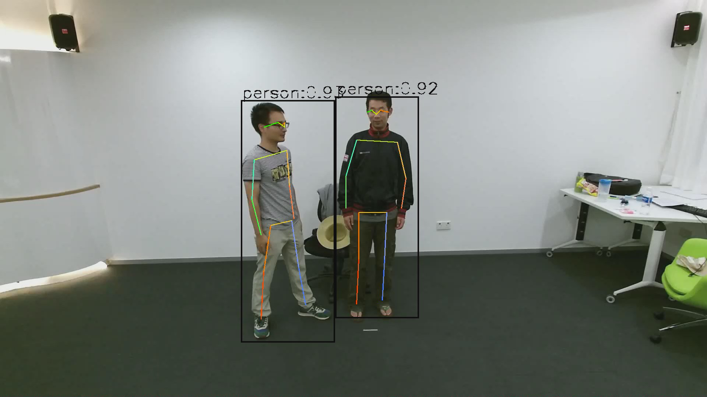
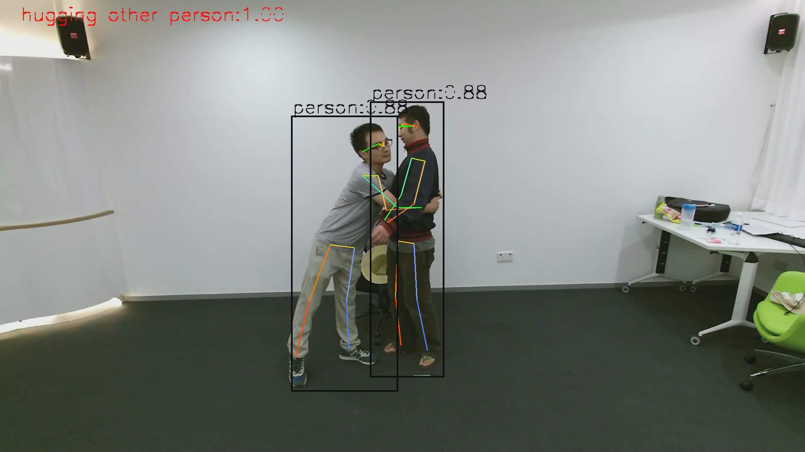

# YOLOV5-FASTPOSE-POSEC3D Demo

[English](README_EN.md) | 简体中文

## 目录
- [YOLOV5-FASTPOSE-POSEC3D Demo](#yolov5-fastpose_posec3d-demo)
  - [目录](#目录)
  - [1. 简介](#1-简介)
  - [2. 特性](#2-特性)
  - [3. 准备模型与数据](#3-准备模型与数据)
  - [4. 环境准备](#4-环境准备)
    - [4.1 x86/arm PCIe平台](#41-x86arm-pcie平台)
    - [4.2 SoC平台](#42-soc平台)
  - [5. 程序编译](#5-程序编译)
    - [5.1 x86/arm PCIe平台](#51-x86arm-pcie平台)
    - [5.2 SoC平台](#52-soc平台)
  - [6. 程序运行](#6-程序运行)
    - [6.1 Json配置说明](#61-json配置说明)
    - [6.2 运行](#62-运行)
  - [7. 性能测试](#7-性能测试)

## 1. 简介

本例程用于说明如何使用sophon-stream快速构建视频姿态识别应用。

本例程插件的连接方式如下图所示


**源代码** (https://github.com/MVIG-SJTU/AlphaPose和https://github.com/open-mmlab/mmaction2) 

本例程中，posec3d、fastpose和yolov5算法的前处理、推理、后处理分别在九个element上进行运算，element内部可以开启多个线程，保证了一定的检测效率

## 2. 特性

* 支持BM1684X(x86 PCIe、SoC)
* YOLOv5的AlphaPose支持BM1684(x86 PCIe、SoC)、BM1684(x86 PCIe、SoC)
* 支持多路视频流
* 支持多线程
* BM1684X平台上，支持yolov5 tpu_kernel后处理

## 3. 准备模型与数据

​在`scripts`目录下提供了相关模型和数据的下载脚本 [download.sh](./scripts/download.sh)。

```bash
# 安装unzip，若已安装请跳过，非ubuntu系统视情况使用yum或其他方式安装
sudo apt install unzip
chmod -R +x scripts/
./scripts/download.sh
```

脚本执行完毕后，会在当前目录下生成`data`目录，其中包含`models`和`videos`两个子目录。

**注意：fastpose和posec3d BModel模型暂时只支持BM1684X平台。**

下载的模型包括：

```bash
./models
├── BM1684
│   ├── fast_res50_256x192_coco17_1b_fp32.bmodel    # 用于BM1684的FASTPOSE FP32 Bmodel，batch_size=1，17个关键点检测
│   ├── fast_res50_256x192_coco17_1b_int8.bmodel    # 用于BM1684的FASTPOSE INT8 Bmodel，batch_size=1，17个关键点检测
│   ├── yolov5s_v6.1_3output_fp32_1b.bmodel         # 用于BM1684的YOLOV5 FP32 BModel，batch_size=1，后处理在CPU上进行
│   ├── yolov5s_v6.1_3output_int8_1b.bmodel         # 用于BM1684的YOLOV5 INT8 BModel，batch_size=1，后处理在CPU上进行
│   └── yolov5s_v6.1_3output_int8_4b.bmodel         # 用于BM1684的YOLOV5 INT8 BModel，batch_size=4，后处理在CPU上进行
├── BM1684X
│   ├── fast_res50_256x192_coco17_1b_fp16.bmodel    # 用于BM1684X的FASTPOSE FP16 Bmodel，batch_size=1，17个关键点检测
│   ├── fast_res50_256x192_coco17_1b_fp32.bmodel    # 用于BM1684X的FASTPOSE FP32 Bmodel，batch_size=1，17个关键点检测
│   ├── fast_res50_256x192_coco17_1b_int8.bmodel    # 用于BM1684X的FASTPOSE INT8 Bmodel，batch_size=1，17个关键点检测
│   ├── posec3d_gym_fp16.bmodel                     # 用于BM1684X的POSEC3D FP16 Bmodel，gym 99类识别
│   ├── posec3d_gym_fp32.bmodel                     # 用于BM1684X的POSEC3D FP32 Bmodel，gym 99类识别
│   ├── posec3d_ntu60_fp16.bmodel                   # 用于BM1684X的POSEC3D FP16 Bmodel，ntu 60类识别
│   ├── posec3d_ntu60_fp32.bmodel                   # 用于BM1684X的POSEC3D FP32 Bmodel，ntu 60类识别
│   ├── posec3d_ntu60_int8.bmodel                   # 用于BM1684X的POSEC3D INT8 Bmodel，ntu 60类识别
│   ├── yolov5s_v6.1_3output_fp16_1b.bmodel         # 用于BM1684X的YOLOV5 FP16 BModel，batch_size=1，后处理在CPU上进行
│   ├── yolov5s_v6.1_3output_fp32_1b.bmodel         # 用于BM1684X的YOLOV5 FP32 BModel，batch_size=1，后处理在CPU上进行
│   ├── yolov5s_v6.1_3output_int8_1b.bmodel         # 用于BM1684X的YOLOV5 INT8 BModel，batch_size=1，后处理在CPU上进行
│   └── yolov5s_v6.1_3output_int8_4b.bmodel         # 用于BM1684X的YOLOV5 INT8 BModel，batch_size=4，后处理在CPU上进行
└── BM1684X_tpukernel
    ├── yolov5s_tpukernel_fp16_1b.bmodel            # 用于BM1684X的YOLOV5 FP16 BModel，batch_size=1，后处理采用tpu_kernel
    ├── yolov5s_tpukernel_fp32_1b.bmodel            # 用于BM1684X的YOLOV5 FP32 BModel，batch_size=1，后处理采用tpu_kernel
    ├── yolov5s_tpukernel_int8_1b.bmodel            # 用于BM1684X的YOLOV5 INT8 BModel，batch_size=1，后处理采用tpu_kernel
    └── yolov5s_tpukernel_int8_4b.bmodel            # 用于BM1684X的YOLOV5 INT8 BModel，batch_size=4，后处理采用tpu_kernel
```

下载的数据包括：
```bash
./videos
├── demo_skeleton.mp4                         # 人体检测+关键检测+行为识别测试视频 
├── S017C001P003R001A001_rgb.avi              # 人体检测+关键检测+行为识别测试视频 
├── S017C001P003R002A008_rgb.avi              # 人体检测+关键检测+行为识别测试视频 
└── test.mp4                                  # 人体检测+关键检测测试视频
```

## 4. 环境准备

### 4.1 x86/arm PCIe平台

如果您在x86/arm平台安装了PCIe加速卡（如SC系列加速卡），可以直接使用它作为开发环境和运行环境。您需要安装libsophon、sophon-opencv和sophon-ffmpeg，具体步骤可参考[x86-pcie平台的开发和运行环境搭建](../../docs/EnvironmentInstallGuide.md#3-x86-pcie平台的开发和运行环境搭建)或[arm-pcie平台的开发和运行环境搭建](../../docs/EnvironmentInstallGuide.md#5-arm-pcie平台的开发和运行环境搭建)。

### 4.2 SoC平台

如果您使用SoC平台（如SE、SM系列边缘设备），刷机后在`/opt/sophon/`下已经预装了相应的libsophon、sophon-opencv和sophon-ffmpeg运行库包，可直接使用它作为运行环境。通常还需要一台x86主机作为开发环境，用于交叉编译C++程序。

## 5. 程序编译

### 5.1 x86/arm PCIe平台
可以直接在PCIe平台上编译程序，具体请参考[sophon-stream编译](../../docs/HowToMake.md)

### 5.2 SoC平台
通常在x86主机上交叉编译程序，您需要在x86主机上使用SOPHON SDK搭建交叉编译环境，将程序所依赖的头文件和库文件打包至sophon_sdk_soc目录中，具体请参考[sophon-stream编译](../../docs/HowToMake.md)。本例程主要依赖libsophon、sophon-opencv和sophon-ffmpeg运行库包。

## 6. 程序运行

### 6.1 Json配置说明

yolov5-fastpose demo中各部分参数位于 [config](./config/) 目录，结构如下所示：

```bash
./config/
├── decode.json                         # 解码配置
├── engine_group_alphapose.json         # sophon-stream 人体检测+关键检测graph配置
├── engine_group.json                   # sophon-stream 人体检测+关键检测+行为识别graph配置
├── fastpose_group.json                 # fastpose 配置
├── fastpose_infer.json                 # fastpose 推理配置
├── fastpose_post.json                  # fastpose 后处理配置
├── fastpose_pre.json                   # fastpose 前处理配置
├── posec3d_group.json                  # posec3d 配置
├── yolov5_fastpose_posec3d_demo.json   # yolov5-fastpose-posec3d demo配置
├── yolov5_group.json                   # yolov5 配置
├── yolov5_infer.json                   # yolov5 推理配置
├── yolov5_post.json                    # yolov5 后处理配置
└── yolov5_pre.json                     # yolov5 前处理配置
```

[engine_group_alphapose.json](./config/engine_group_alphapose.json)是伴随yolov5作为检测器的alphapose算法，输出人体检测框和人体关键点，输出如下图：



在其基础上增加posec3d行为识别模型构成配置文件[engine_group.json](./config/engine_group.json)，输出人体检测框、人体关键点和行为类别，输出如下图



注意在该图中posec3d以72帧作为输入，最终类别标签打在第0帧上，该视频来自download.sh脚本下载的视频demo_skeleton.mp4。

其中，[yolov5_fastpose_posec3d_demo.json](./config/yolov5_fastpose_posec3d_demo.json)是例程的整体配置文件，管理输入码流等信息。在一张图上可以支持多路数据的输入，channels中包含各路的码流url等信息。

配置文件中不指定`channel_id`属性的情况，会在demo中对每一路数据的`channel_id`从0开始默认赋值。

`heatmap_loss` 参数决定fastpose的后处理流程，目前基于官方的[模型配置](https://github.com/MVIG-SJTU/AlphaPose/blob/master/docs/MODEL_ZOO.md)，只支持了 `MSELoss`。

```json
{
  "channels": [
    {
      "channel_id": 0,
      "url": "../yolov5_fastpose_posec3d/data/nturgb+d_rgb/S017C001P003R002A008_rgb.avi",
      "source_type": "VIDEO",
      "sample_interval": 1,
      "loop_num": 1,
      "fps": -1
    }
  ],
  "class_names": "../yolov5_fastpose_posec3d/data/coco.names",
  "download_image": true,
  "draw_func_name": "draw_yolov5_fastpose_posec3d_results",
  "engine_config_path": "../yolov5_fastpose_posec3d/config/engine_group.json",
  "heatmap_loss": "MSELoss"
}
```

[engine_group.json](./config/engine_group.json)包含对graph的配置信息，这部分配置确定之后基本不会发生更改。

这里摘取配置文件的一部分作为示例：在该文件内，需要初始化每个element的信息和element之间的连接方式。element_id是唯一的，起到标识身份的作用。element_config指向该element的详细配置文件地址，port_id是该element的输入输出端口编号，多输入或多输出的情况下，输入/输出编号也不可以重复。is_src标志当前端口是否是整张图的输入端口，is_sink标识当前端口是否是整张图的输出端口。
connection是所有element之间的连接方式，通过element_id和port_id确定。

```json
[
    {
        "graph_id": 0,
        "device_id": 0,
        "graph_name": "yolov5_fastpose_posec3d",
        "elements": [
            {
                "element_id": 5000,
                "element_config": "../yolov5_fastpose_posec3d/config/decode.json",
                "ports": {
                    "input": [
                        {
                            "port_id": 0,
                            "is_sink": false,
                            "is_src": true
                        }
                    ]
                }
            },
            {
                "element_id": 5001,
                "element_config": "../yolov5_fastpose_posec3d/config/yolov5_group.json",
                "inner_elements_id": [10001, 10002, 10003]
            },
            {
                "element_id": 6001,
                "element_config": "../yolov5_fastpose_posec3d/config/fastpose_group.json",
                "inner_elements_id": [20001, 20002, 20003]
            },
            {
                "element_id": 7001,
                "element_config": "../yolov5_fastpose_posec3d/config/posec3d_group.json",
                "inner_elements_id": [30001, 30002, 30003],
                "ports": {
                    "output": [
                        {
                            "port_id": 0,
                            "is_sink": true,
                            "is_src": false
                        }
                    ]
                }
            }
        ],
        "connections": [
            {
                "src_element_id": 5000,
                "src_port": 0,
                "dst_element_id": 5001,
                "dst_port": 0
            },
            {
                "src_element_id": 5001,
                "src_port": 0,
                "dst_element_id": 6001,
                "dst_port": 0
            },
            {
                "src_element_id": 6001,
                "src_port": 0,
                "dst_element_id": 7001,
                "dst_port": 0
            }
        ]
    }
]
```

[fastpose_group.json](./config/fastpose_group.json)等配置文件是对具体某个element的配置细节，设置了模型参数、动态库路径、阈值等信息。该配置文件不需要指定`id`字段和`device_id`字段，例程会将`engine.json`中指定的`element_id`和`device_id`传入。其中，`thread_number`是`element`内部的工作线程数量，一个线程会对应一个数据队列，多路输入情况下，需要合理设置数据队列数目，来保证线程工作压力均匀且合理。

`use_tpu_kernel`为`true`时，会使用yolov5 tpu_kernel后处理。tpu_kernel后处理只支持BM1684X设备。

```json
{
    "configure": {
        "model_path": "../yolov5_fastpose_posec3d/data/models/BM1684X/halpe26_fast_res50_256x192_int8_1b.bmodel",
        "stage": [
            "pre"
        ],
        "heatmap_loss": "MSELoss",
        "area_thresh": 0.0
    },
    "shared_object": "../../build/lib/libfastpose.so",
    "name": "fastpose",
    "side": "sophgo",
    "thread_number": 1
}
```

### 6.2 运行

对于PCIe平台，可以直接在PCIe平台上运行测试；对于SoC平台，需将交叉编译生成的动态链接库、可执行文件、所需的模型和测试数据拷贝到SoC平台中测试。

SoC平台上，动态库、可执行文件、配置文件、模型、视频数据的目录结构关系应与原始sophon-stream仓库中的关系保持一致。

测试的参数及运行方式是一致的，下面主要以PCIe模式进行介绍。

运行可执行文件
```bash
./main --demo_config_path=../yolov5_fastpose_posec3d/config/yolov5_fastpose_posec3d_demo.json
```

3路视频流运行结果如下
```bash
 total time cost 5453888 us.
frame count is 291 | fps is 53.3564 fps.
```

## 7. 性能测试

不同视频性能差别较大，以实际为准。
