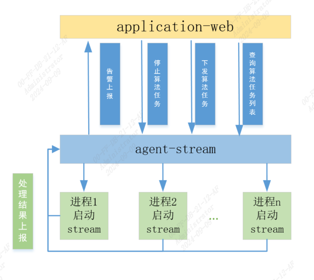
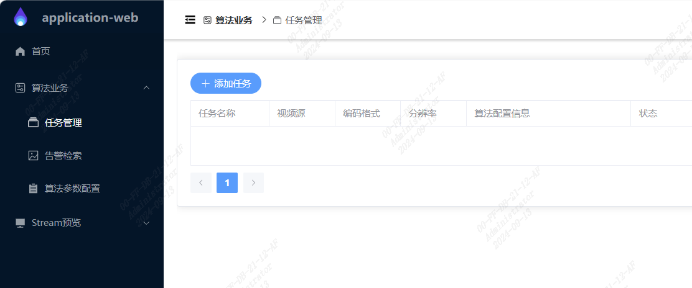
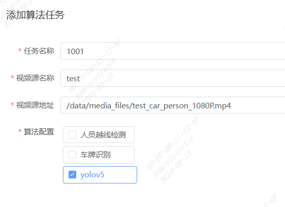
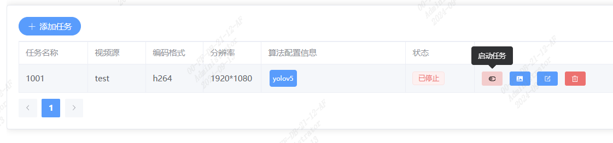
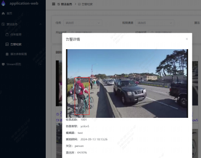
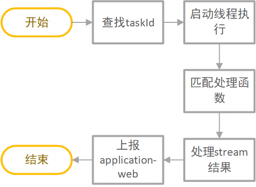

# stream-agent
## 目录
- [stream-agent](#stream-agent)
  - [目录](#目录)
  - [1.简介](#1简介)
    - [1.1 代码目录结构说明](#11-代码目录结构说明)
  - [2.快速开始](#2快速开始)
    - [2.1 安装application-web](#21-安装application-web)
    - [2.2 启动stream-agent](#22-启动stream-agent)
    - [2.3 运行算法任务](#23-运行算法任务)
  - [3.server.py说明](#3serverpy说明)
    - [3.1 接口文档](#31-接口文档)
    - [3.2 接口实现说明](#32-接口实现说明)
      - [3.2.1 创建任务](#321-创建任务)
      - [3.2.2 删除任务](#322-删除任务)
      - [3.2.3 任务列表查询](#323-任务列表查询)
      - [3.2.4 处理stream结果并发送到application-web](#324-处理stream结果并发送到application-web)
## 1.简介
stream-agent是sophon-stream代理应用，使用python开发了一套基于sophon-stream的应用。对外开放http接口，实现sophon-stream任务启动、停止、配置等功能。配合[application-web](https://github.com/sophgo/application-web)可实现一套部署于算能SoC设备中的算法应用。  
stream-agent框架如图所示：  
  
其中application-web是算法应用软件，包括算法任务配置、告警图片展示等功能；通过4个http接口对接stream-agent。

### 1.1 代码目录结构说明
```bash
├── common.py #基础函数，如拷贝目录，检测文件
├── config_algorithm.py #算法配置文件，调用samples中的python函数
├── samples
│   ├── license_area_intrusion #车牌识别例程
│   │   ├── config #启动stream的基础配置文件，启动任务时会拷贝config文件内容到tasks目录，并修改每个json配置中文件位置
│   │   │   ├── converger.json
│   │   │   ├── decode.json
│   │   │   ├── distributor_time_class.json
│   │   │   ├── engine_group.json
│   │   │   ├── filter.json
│   │   │   ├── http_push.json
│   │   │   ├── license_area_intrusion_demo.json
│   │   │   ├── lprnet_group.json
│   │   │   └── yolov5_group.json
│   │   └── license_area_intrusion.py #车牌识别算法处理，包括修改config配置文件和接受stream结果并上报函数
│   ├── openpose #人体pose检测（关键点识别）
│   ├── tripwire #人员越线检测
│   ├── yolov5 #yolov5例程
│   └── yolov8 #yolov8例程
├── server.py #运行主程序
└── start_server.sh #启动脚本
```
## 2.快速开始
>  **运行环境：** 算能SoC设备  

> **注意：**  
1. 在启动之前，您需要将编译好的`sophon-stream`完整的拷贝到SoC设备
2. 跑通sophon-stream的samples中部分应用，如yolov5例程，知晓启动方式以及json文件如何配置等。如果需要启动yolov5算法应用，需要在sophon-stream/samples/yolov5下载好对应的模型等数据。   
3. 下面所有安装都是在SoC设备进行    

### 2.1 安装application-web  
```bash
pip3 install dfss -i https://pypi.tuna.tsinghua.edu.cn/simple --upgrade
python3 -m dfss --url=open@sophgo.com:/sophon-stream/tools/application-web-linux_arm64.tgz
tar -xzvf application-web-linux_arm64.tgz
cd application_web
sudo ./install.sh
```
安装完成后，使用浏览器输入`http://{ip}:8089`，打开页面，ip为SoC平台设备ip地址。用户名和密码均为`admin`  

### 2.2 启动stream-agent
1. 修改`stream-agent/samples`目录中config内容，以车牌识别例程(license_area_intrusion)为例  
license_area_intrusion内容如下：
``` bash
.
├── config
│   ├── converger.json
│   ├── decode.json
│   ├── distributor_time_class.json
│   ├── engine_group.json
│   ├── filter.json
│   ├── http_push.json
│   ├── license_area_intrusion_demo.json
│   ├── lprnet_group.json
│   └── yolov5_group.json
└── license_area_intrusion.py
```
根据设备类型修改`yolov5_group.json`和`lprnet_group.json`配置中"model_path"的值；以`yolov5_group.json`为例，初始值为
`"{Stream_path}/samples/license_area_intrusion/models/yolov5s-licensePLate/BM1684X/yolov5s_v6.1_license_3output_int8_1b.bmodel"`,其中`{Stream_path}`为sophon-stream目录位置，无需改动；若SoC设备是SE9-16，那么就需要修改为BM1688的模型，如`"{Stream_path}/samples/license_area_intrusion/models/yolov5s-licensePLate/BM1688/yolov5s_v6.1_license_3output_int8_1b_2core.bmodel"`  
如果您需要运行其它模型，yolov5、yolov8等，则修改`stream-agent/samples`中对应config配置中模型的路径。  

2. 安装python依赖
```bash
pip3 install  Pillow -i https://pypi.tuna.tsinghua.edu.cn/simple
```  
3. 运行stream-agent
```bash
cd tools/stream-agent #进入stream-agent目录
./start_server.sh
``` 
### 2.3 运行算法任务
1. 浏览器打开application-web的任务管理页面  

2. 添加算法任务  

3. 启动算法任务  

4. 查看告警  


## 3.server.py说明
### 3.1 接口文档
[stream-agent接口说明](./docs/stream-agent.md)
### 3.2 接口实现说明
#### 3.2.1 创建任务  
  
在`build_start(data)`函数中实现，首先在在tasks文件夹中根据任务名称创建任务文件（如task_1001），然后获取下发的算法类型比如yolov5，将`stream-agent/samples/yolov5/config`文件拷贝到task_1001；  
将`task_1001/config`文件中的各个json文件进行配置，如替换`{Stream_path}`为sophon-stream的实际地址，检查json文件中模型文件是否存在等；  
调用`samples/yolov5/yolov5.py中yolov5_build_config`函数，修改demo.json和group.json对应数据
在task_1001目录启动sophon-stream子进程，sophon-stream输出的日志保存在`task_1001_stream.log`，加入`process_pools`监测  
#### 3.2.2 删除任务
根据任务ID停止process_pools中的子进程，删除taskId_map中任务数据
#### 3.2.3 任务列表查询
从taskId_map中获取任务状态，返回任务列表
#### 3.2.4 处理stream结果并发送到application-web
sophon-stream运行结果是通过http的方式发送到stream-agent的/alarm/rev接口   
stream的http插件配置：
```json
{
  "configure": {
    "ip": "127.0.0.1",
    "port": 8001,
    "path": "/alarm/rev"
  },
  "shared_object": "{Stream_path}/build/lib/libhttp_push.so",
  "name": "http_push",
  "side": "sophgo",
  "thread_number": 1
}
```
处理该接口时，必须明确sophon-stream的http上报结果格式，每种算法上报的格式都不一样，获取上报数据格式可参考[application-web工具使用](../../samples/structured_recognition/README.md#6)；  
下面是车牌识别算法上报的结果。其中`mDetectedObjectMetadatas`是yolov5检测的结果，`mSubObjectMetadatas`是基于yolov5车牌检测进行识别的结果，是一一对应的。`"mSpData"`是图片base64编码，此处省略内容。
```json
{
    "mDetectedObjectMetadatas": [
        {
            "mBox": {
                "mHeight": 84,
                "mWidth": 357,
                "mX": 222,
                "mY": 408
            },
            "mClassify": 0,
            "mScores": [
                0.9197901487350464
            ]
        }
    ],
    "mFps": 0.0,
    "mFrame": {
        "mChannelId": 0,
        "mEndOfStream": false,
        "mFrameId": 10,
        "mHeight": 1024,
        "mSpData": "/9j/2wBDAA7VAAAAAAA==",
        "mTimestamp": 1721992917985880,
        "mWidth": 1920
    },
    "mGraphId": 0,
    "mSubId": 0,
    "mSubObjectMetadatas": [
        {
            "mFps": 0.5036436915397644,
            "mFrame": {
                "mChannelId": 0,
                "mEndOfStream": false,
                "mFrameId": 10,
                "mHeight": 0,
                "mSpData": "/9jAAA",
                "mTimestamp": 0,
                "mWidth": 0
            },
            "mGraphId": -1105730188,
            "mRecognizedObjectMetadatas": [
                {
                    "mLabelName": "皖AD10005",
                    "mScores": [],
                    "mTopKLabels": []
                }
            ],
            "mSubId": 1
        }
    ]
}
```
处理流程：  
  
首先根据`"mChannelId"`从`taskId_map`中获取`taskId`等信息，然后根据算法类型（如yolov5），进入`samples/yolov5/yolov5.py`的`yolov5_trans_json(json_data, task_id, Type)`函数
将yolov5的结果进行裁剪，进行base64编码
上报到application-web