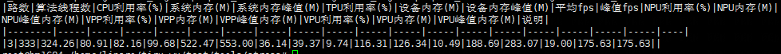

# 压测脚本使用说明

## 说明

* 本目录下的`stress.sh`和`get_stress_metric.py`文件为sophon-stream在soc模式下进行压测的文件，pcie模式无法运行。`stress.sh`会根据参数运行某个例程并保存运行过程中的算法、设备、系统信息；`get_stress_metric.py`会从保存的信息中统计出如cpu利用率、fps等各项指标。

* 使用前，推荐切换到root用户，以保证有足够的文件权限。 

## 1. stress.sh

使用方法：

```bash
# ./stress.sh <sample path> <sample log name> <tpu log name> <cpu log name> <npu_vpp_vpu log name> <inputs and threads>
./stress.sh ../../samples/yolov5/build/yolov5_demo alg.log tpu.log host.log dev.log 1111
```

上述命令中的最后一项参数是例程的输入路数和算法线程数，例如：一路输入，前处理、推理、后处理各一个线程的情况，可以写作`1111`。

该脚本不会根据参数中的输入路数和算法线程数来修改对应例程的配置文件，因此，最后一项参数实际上只是起到了标识作用。实际使用中，请注意最后一项参数与实际配置一致。

运行结束后，会在当前目录下生成保存了所有日志信息的子目录。

## 2. get_stress_metric.py

使用方法：

```bash
# python3 get_stress_metric.py --alg_log <sample log path> --tpu_log <tpu log path> --host_log <cpu log path> --dev_log <npu_vpp_vpu log path> --channel_combination <inputs and threads>
python3 get_stress_metric.py --alg_log ./yolov5_demo/1111/alg.log --tpu_log ./yolov5_demo/1111/tpu.log --host_log ./yolov5_demo/1111/host.log --dev_log ./yolov5_demo/1111/dev.log --channel_combination 1111
```

该脚本以`stress.sh`输出的日志文件为输入，依据其计算多项指标。

该脚本输出结果为markdown格式的表格，参考结果如下：



