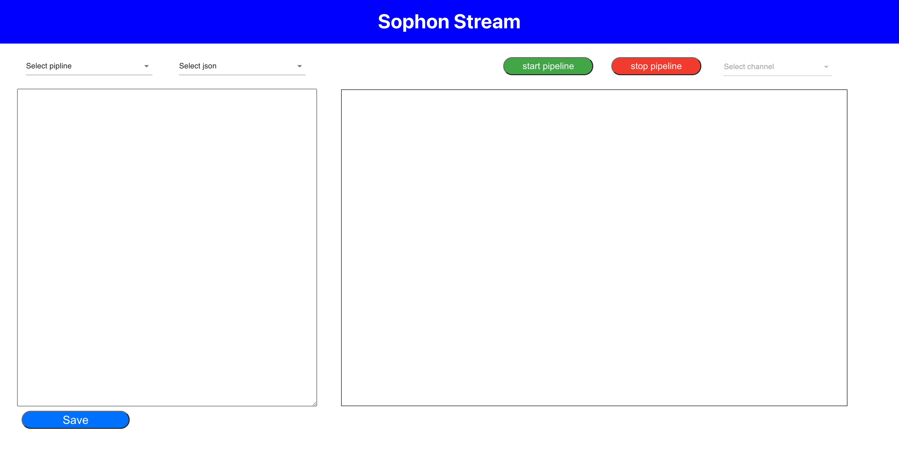

# visualize

## 1 简介

visualize是针对sophon-stream项目运行的可视化工具。本工具能够将项目的运行结果在前端可视化，使得用户能够实时了解到项目的推理结果。通过该工具，用户可以在前端实时查看项目的推理结果，直观了解每个阶段的处理情况和输出。这种交互性的可视化方式为项目的调试和优化提供了极大的便利，使得非技术人员也能轻松使用。

项目总共包含两个子目录，一个子目录是server，为项目的后端程序，另外一个子目录是web_ui，为项目的前端程序。想要使用本项目，首先需要启动web_server后端程序，然后再启动web_ui前端程序，具体启动方法，请查看后续的快速入门文档。

## 2 功能介绍

visualize可视化工具为用户提供以下几种功能：

   - 图形化的操作和配置界面：

     我们为每个pipeline都提供了内置的pipeline示例配置，您可以直接运行示例，快速体验sophon-stream。
   - 支持修改不同pipeline参数：

     我们支持在线配置pipeline的各种参数，您可以直接点击选择不同的配置文件，在线提交。
   - 支持预览pipeline运行结果：

     支持预览实时运行中的视频结果；

## 3 使用方法
使用本项目工具，请依次启动`server`后端程序和`ui`前端程序，请依次参考下列入门使用方法：

首先请参考后端程序的入门使用方法，将后端程序开启，请参考[server用户文档](./server/README.md)

然后请参考前端程序的入门使用方法，将前端程序开启，请参考[web_ui用户文档](./web_ui/README.md)
