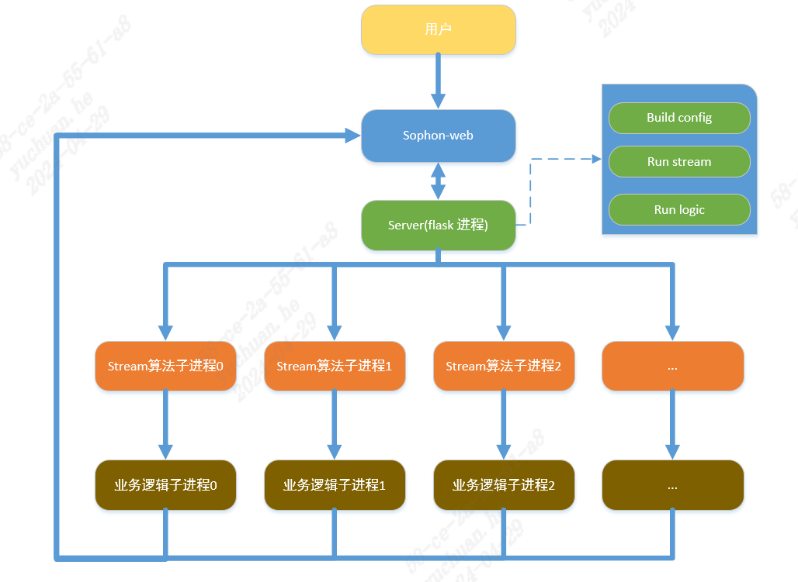

# stream-server

## 介绍
此框架意图是为了打通application-web与sophon-stream，通过json配置文件,使得底层算法与上层前端可以联动。

## 特性
本框架实现了简单的业务层逻辑demo和json配置文件转换功能。


本框架包含一个主要后端server，以flask框架搭建，由server进行接受前端json，并做任务下发和任务管理，每个任务对应一个stream算法进程和一个业务层逻辑进程，业务层也是由flask框架搭建。

一个数据流的流程图如下所示



## 准备sophon-stream算法
参考[sophon-stream](../../README.md)根据算法需求准备好模型与数据，并完成stream编译，生成main函数接口，此接口为sophon-stream进程主要逻辑的入口，根据命名格式完成config命名，注意入口参数config一般以算法名称+'_demo'命名，算法名称为samples下文件目录名称。


算法定义了TYPE映射保存在server中，对应application-web中算法，如
```
map_type={16:'license_plate_recognition'}
```
备注：使用前要将stream图加上http_push插件以将stream的结果上传到应用层，添加方式如下。

server.py会自动完成以下操作

1.找到stream图,把图中数据流output删除，找到如下部分并删除
```

                "ports": {
                    "output": [
                        {
                            "port_id": 0,
                            "is_sink": true,
                            "is_src": false
                        }
                    ]
                }
```

2.在数据流最后添加element，如下，element_id与其他element区分
```
            {
                "element_id": 5005,
                "element_config": "../license_plate_recognition/config/http_push.json",
                "ports": {
                    "output": [
                        {
                            "port_id": 0,
                            "is_sink": true,
                            "is_src": false
                        }
                    ]
                }
            }
```

3.添加之前数据流output与http_push,element的连接，如下
```
            {
                "src_element_id": 6001,
                "src_port": 0,
                "dst_element_id": 5005,
                "dst_port": 1
            }
```
           
## server使用方式
由server进行接受前端json，并做任务下发和任务管理，包含线程池和端口管理。


提供了python接口
```
python3 server.py --stream_path="/path/to/stream"
```

其中包含服务如下,设置遵循application-web接口规则
```
/task/list # 完成查询任务列表功能
/task/create # 完成创建任务功能
/task/query  # 完成查询任务状态功能
/task/delete # 完成删除任务功能
```


## 创建任务功能
主要逻辑模块之一，包含以下模块

### build_config
```
def build_config(data):
    '''
    return :  demo_config_path,TaskID,Type
    '''
```
接受application-web请求并转换成stream config规则，此部分不同算法具有特异性，需要根据具体算法配置extend选项进行修改代码。
### build_task
```
def build_task(demo_config_path,task_id,Type,result_url):
    '''
    return :  0
    '''
```
起stream算法进程和业务层进程

stream算法进程，完成算法,并将逐帧结果通过post请求推送到业务层

业务层进程 [client](#client使用方式)，业务层进程需要占用端口，默认从10001开始递增

## client使用方式
使用方式如下


默认参数
```
--task_id, type=str, default="0", help='id of task'
--type, type=int, default=0, help='type of algorithm'
--host, type=str, default="0.0.0.0", help='ip of host'
--port, type=int, default=11100, help='port of host'
--url, type=str, default="", help='report url'
```

由于算法是逐帧反馈的，所以具体业务需要对算法的结果进行反馈，逐帧反馈是不现实的，会严重占用带宽，需要业务层逻辑进行筛选。

实现了接受stream结果，并进行业务筛选(如车牌识别去重筛选告警功能)，此部分具有特异性，需要根据需求修改，并转换为application-web接口格式做出告警,并使用post请求做异步上报,多个上报地址采取轮询的负载均衡机制，亦可以保存json到本地文件。

本例程中只对连续出现n帧并且没有连续消失m帧的进行告警。可以根据需求在修改。

## 快速入门

一般完成一个简单算法业务需要根据框架中的模板添加samples子目录，以算法名称命名，并将算法映射到config_algorithm.py中。

添加如下映射及转换函数,函数亦应以算法名称命名
```
import samples.area_intrusion as area_intrusion
import samples.tripwire as tripwire

map_type={1:'area_intrusion', 2:'tripwire'}
class Algorithms:
    def tripwire_build_config(self,algorithm_name,stream_path,data,port,i):
        return tripwire.tripwire.tripwire_build_config(algorithm_name,stream_path,data,port,i)
    def tripwire_trans_json(self,json_data,task_id,Type,up_list):
        return tripwire.tripwire.tripwire_trans_json(json_data,task_id,Type,up_list)
    def tripwire_logic(self,json_data,up_list,rm_list):
        return tripwire.tripwire.tripwire_logic(json_data,up_list,rm_list)
    def area_intrusion_build_config(self,algorithm_name,stream_path,data,port,i):
        return area_intrusion.area_intrusion.area_intrusion_build_config(algorithm_name,stream_path,data,port,i)
    def area_intrusion_trans_json(self,json_data,task_id,Type,up_list):
        return area_intrusion.area_intrusion.area_intrusion_trans_json(json_data,task_id,Type,up_list)
    def area_intrusion_logic(self,json_data,up_list,rm_list):
        return area_intrusion.area_intrusion.area_intrusion_logic(json_data,up_list,rm_list)
    
```

在samples算法目录下填充对应算法的build_config,trans_json,logic函数

提供了工具，可以使用samples/add_algorithm.sh进行添加
```
bash add_algorithm.sh name type
```

### config_logic
主要配置业务逻辑需要的参数设置。

以车牌识别为例，设置数据结构infos记录车牌连续出现次数和连续消失次数，并设置阙值以完成业务逻辑。

如下

```
license_plate_recognition_infos={}
license_plate_recognition_in_thresh=3
license_plate_recognition_out_thresh=5
```
### logic
主要实现业务逻辑层功能。

以车牌识别为例，只对连续出现n帧并且没有连续消失m帧的进行告警。

### build_config
主要是application-web的任务下发json与stream的json文件的转换。

```
def algorithm_build_config(algorithm_name,stream_path,data,port):
 '''
    return :  demo_config_path
    '''
```

参数包括算法名称，stream路径，数据，业务逻辑进程端口号

为了完成config转换功能，我们需要知道sophon-stream和application-web的config的对应关系

一个application-web的任务下发json如下
```
data = {
    "TaskID": task_id,
    "InputSrc": {
        "SrcID": "600100000445030222",
        "StreamSrc": {
            "Address": "rtsp://172.26.13.17:8554/mystream"
        }
    },
    "Algorithm": [
        {
            "Type": 16,
            "TrackInterval": 1,
            "DetectInterval": 5,
            "TargetSize": {
                "MinDetect": 30,
                "MaxDetect": 250
            },
            "DetectInfos": None,
            # "DetectInfos": [
            #     {
            #         "TripWire": {
            #             "LineStart": {"X": 100, "Y": 200},
            #             "LineEnd": {"X": 500, "Y": 300},
            #             "DirectStart": {"X": 170, "Y": 260},
            #             "DirectEnd": {"X": 170, "Y": 260}
            #         },
            #         "HotArea": [
            #             {"X": 10, "Y": 10},
            #             {"X": 191, "Y": 10},
            #             {"X": 191, "Y": 107},
            #             {"X": 10, "Y": 107}
            #         ]
            #     }
            # ],
            "Extend": {"key": "value"}
        }
    ],
    "Reporting": {
        "ReportUrlList": ["http://172.18.0.123:9092/upload/data"]
    }
}
```
|参数|数据类型|说明|
|----|----|----|
|TaskID	|string	|任务id|
|InputSrc	|json	|采集源输入参数|
|SrcID|	string	|国标20位编码|
|StreamSrc|	json|	取流信息|
|Address|	string|	完整取流地址，分析服务不要做地址校验；授权信息都在url中；rtsp格式：rtsp://ip:port/{资源路径}；国标格式：gb28181_playback://用户ID:用户密码@ip:port?deviceid=32028102001310000001#devicetype=3#localid=85736920137981016514#begtime=20231024155207#endtime=20231024160810|
|Algorithm|	array |[可选]算法参数|
|Algorithm[0]|json|	第一个事件的算法参数|
|Type|int	|事件类型|
|TrackInterval	|int	|跟踪帧间隔|
|DetectInterval|int|	检测帧间隔|
|TargetSize	|json|	检测目标参数|
|MinDetect|	int|	检测目标最小|
|MaxDetect|	int|	检测目标最大|
|DetectInfos|	array|	检测信息数组|
|DetectInfos[0]|json	|第一个检测信息|
|TripleWire|	json|	辅助线|
|LineStart|	json	|辅助线起点|
|LineEnd	|json|	辅助线终点|
|DirectStart|	json	|方向线起点|
|DirectEnd	|json	|方向线终点|
|X|	int	|x坐标|
|Y |int|	y坐标|
|HotArea|	array|	检测区域顶点列表|
|HotArea[0]|json|	检测区域第一个顶点|
|Extend	|json	|除已知参数外的额外可选参数，由用户提供|
|Reporting	|json	|数据推送上报参数|
|ReportUrlList	|string	|//多个上报数据地址url，分析服务做轮询上报，来完成负载均衡|


一般需要修改主demo的json文件,如下
```
{
  "channels": [
    {
      "channel_id": 0,
      "url": "rtsp://172.26.13.17:8554/mystream",
      "source_type": "RTSP",
      "loop_num": 1,
      "fps": 1,
      "sample_interval": 1
    }
  ],
  "class_names": "../license_plate_recognition/data/coco.names",
  "download_image": false,
  "draw_func_name": "draw_license_plate_recognition_results",
  "engine_config_path": "../license_plate_recognition/config/engine_group.json"
}
```


|      参数名    |    类型    | 默认值 | 说明 |
|:-------------:| :-------: | :------------------:| :------------------------:|
| channel_id | 整数   | 无 | 输入数据通道编号 |
|   url      | 字符串 | 无 | 输入数据路径，包括本地视频、图片、视频流和base64对应url后缀 |
|source_type | 字符串  | 无  | 输入数据类型，"RSTP"代表RTSP视频流，“RTMP”代表RTMP视频流，“GB28181”代表GB28181视频流，“VIDEO”代表本地视频，“IMG_DIR”代表图片文件夹， “BASE64”代表base64数据 |
|sample_interval | 整数  | 1  |抽帧数，如设置为5，表示每5帧有1帧会被后续处理，即为ObjectMata mFilter字段为false|
|loop_num | 整数  | 1  | 循环次数，仅适用于source_type为"VIDEO"和“IMG_DIR”，值为0时无限循环|
|fps | 浮点数  | 30 | 用于控制视频流的fps，fps=-1表示不控制fps；其它情况下，source_type为"IMG_DIR"或"BASE64"时由设置的值决定，其他source_type从视频流读取fps，设置的值不生效|
|base64_port | 整数  | 12348 | base64对应http端口 |
|skip_element| list | 无 | 设置该路数据是否跳过某些element，目前只对osd和encode生效。不设置时，认为不跳过任何element|
|sample_strategy|字符串|"DROP"|在有抽帧的情况下，设置被抽掉的帧是保留还是直接丢弃。"DROP"表示丢弃，"KEEP"表示保留|

对应关系如下

|stream|application-web|说明|
|----|----|----|
|channels-url|InputSrc-StreamSrc-Address|视频地址|
|channels-sample_interval|Algorithm-DetectInterval/TrackInterval|抽帧数|
|channels-source_type|InputSrc-StreamSrc-Address-[:4]|视频类型|

推流需要修改主http_push的json文件，如下
```
{
  "configure": {
    "ip": "0.0.0.0",
    "port": 10003,
    "route": "/flask_test/113"
  },
  "shared_object": "../../build/lib/libhttp_push.so",
  "name": "http_push",
  "side": "sophgo",
  "thread_number": 1
}
```

| 参数名        | 类型   | 默认值                               | 说明                            |
| ------------- | ------ | ------------------------------------ | ------------------------------- |
| ip            | string | "0.0.0.0"                            | httplib::Client的ip            |
| port   | int | 8000 | httplib::Client的端口，实际使用时，端口号为该port + channel_id  |
| shared_object | string | "../../../build/lib/libhttp_push.so" | libhttp_push动态库路径          |
| name          | string | "http_push"                          | element名称                     |
| side          | string | "sophgo"                             | 设备类型                        |
| thread_number | int    | 1                                    | 启动线程数                      |


对应关系如下
|stream|application-web|说明|
|----|----|----|
|configure-route|TaskID|任务ID|
|configure-port|全局变量自增|进程端口|

检测有感兴趣区域的需要修改检测算法json文件，如下
```
{
  "configure": {
    "model_path": "../license_plate_recognition/models/yolov5s-licensePLate/BM1684/yolov5s_v6.1_license_3output_int8_4b.bmodel",
    "threshold_conf": 0.5,
    "threshold_nms": 0.5,
    "bgr2rgb": true,
    "mean": [
      0,
      0,
      0
    ],
    "std": [
      255,
      255,
      255
    ],
    "roi":{
      "left": 600,
      "top": 400,
      "width": 800,
      "height": 600
    },
    "class_names_file": "../license_plate_recognition/data/coco.names",
    "use_tpu_kernel": false
  },
  "shared_object": "../../build/lib/libyolov5.so",
  "name": "yolov5_group",
  "side": "sophgo",
  "thread_number": 1
}
```
|stream|application-web|说明|
|----|----|----|
|roi|HotArea|感兴趣区域，只支持矩形|

备注：

1.其他application-web参数目前stream并不支持。

2.其他算法特定参数可能在application-web的extend模块中提供，具体参考[sophon-stream](../../README.md)

### trans_json
主要是sophon-stream的结果json与application-web的汇报json文件的转换。

```
def algorithm_trans_json(json_data,task_id,Type,up_list):
 '''
    return :  results
    '''
```

参数包括数据，任务id，任务类型，上报列表

为了完成结果json转换功能，我们需要知道sophon-stream和application-web的json的对应关系

sophon-stream的结果json如下

```
{
  "mDetectedObjectMetadatas": [
    {
      "mBox": {
        "mHeight": 42,
        "mWidth": 106,
        "mX": 306,
        "mY": 693
      },
      "mClassify": 0,
      "mLabelName": "4",
      "mScores": [
        0.533825159072876
      ]
    }
  ],
  "mFrame": {
    "mChannelId": 0,
    "mEndOfStream": false,
    "mFrameId": 2066,
    "mSpData": "#原图base64编码",
    "mTimestamp": 1702547203099557
  },
  "mSubObjectMetadatas": [
    {
      "mFrame": {
        "mChannelId": 0,
        "mEndOfStream": false,
        "mFrameId": 2066,
        "mSpData": "#扣图base64编码",
        "mTimestamp": 0
      },
      "mRecognizedObjectMetadatas": [
        {
          "mLabelName": "\u9c81BD20999",
          "mScores": [],
          "mTopKLabels": []
        }
      ]
    }
  ]
}
```

application-web的结果上报json格式
```
{
    “TaskID":"123",//任务ID
    “SceneImageBase64”: “---”,//场景大图base64字符串
    “SrcID”: “600010030040405050550”,//国标20位编码
    “FrameIndex“:165//帧号
    “AnalyzeEvents“：[
        {    
            “ImageBase64”: “---“,//抠图base64字符串
            “Type”: 1,//分析事件类型
            “Box“: {//目标框坐标
                        "LeftTopY": 200,
                        "RightBtmY": 400,
                        "LeftTopX": 1,
                        "RightBtmX": 3 
            },
            “Extend”:{
                “StayTime”: 10, //停留时间
                “LeaveTime”: 5, //离开时间
                “ObjectCount”: 20, //目标数量
                “VehicleType”: “Motor”,//车辆类型
                “VehicleLicense”: “闽A-9R755”//车牌号
            }//算法携带的额外信息，例如人数检测中的人员数量等
        }
    ] 
}

```

|参数	|数据类型	|说明|
|---|---|---|
|TaskID	|string	|任务通道ID|
|SceneImageBase64|	string	|场景大图base64字符串|
|SrcID	|string|	国标20位编码|
|AnalyzeEvents	|array|	分析事件集合|
|FrameIndex	|int|	帧号|
|Box|	array	|目标框坐标|
|LeftTopY	|int	|左上角y坐标|
|RightBtmY	|int	|左上角x坐标|
|LeftTopX	|int	|右上角y坐标|
|RightBtmX	|int	|右上角x坐标|
|ImageBase64	|string	|抠图base64|
|Type	|int|	事件分析类型:1禁区2越线 3奔跑 4打架 ……|
|Extend	|json	|算法上报的其他额外信息，由厂商提供结构；如果现有的字段满足不了算法的要求，扩展字段会持续以“补充协议”的方式扩充；
|其他属性|		|其他属性描述|

对应关系如下
|stream|application-web|说明|
|----|----|----|
|mFrame-mSpData|SceneImageBase64|原图base64编码|
|mFrame-mFrameId|FrameIndex|帧号|
|mSubObjectMetadatas-mFrame-mSpData|ImageBase64|扣图base64编码|
|mDetectedObjectMetadatas-mBox|Box|检测框，注意需要做坐标转换，stream->net为xywh->xyxy|
|自行规定|Extend|额外信息，如"VehicleLicense"需要算法自行规定|

### 使用方式

```
#命令行使用方式
pip3 install pillow
bash start_server.sh 
```

```
#添加进程重启与恢复现场得使用方式，会对之前启动的任务进行保存，重启的时候会恢复，并且会对非正常退出的任务进行恢复现场
pip3 install pillow
python3 start.py 
```